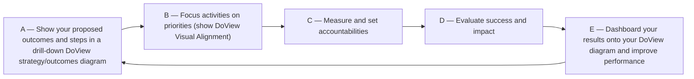

# DoView Tool A1 — The Five Steps in DoView Planning

> **Pair:** [Question](a01question.md) · Tool (this page)

The normal planning, alignment, monitoring, evaluation, and reporting steps for any organization or initiative are shown below together with how these steps are used within typical organizational functions done by any organization or initiative. Note that step 'A' - 'Showing your proposed steps and outcomes in a DoView strategy/outcomes diagram', provides the platform underpinning all of these functions. Using the same DoView strategy/outcomes diagram for all functions means you can achieve the holy grail of full alignment across all organizational functions.

## Diagram

### Examples of where steps are used

| Function | Steps |
|---|---|
| Strategic planning & priority setting | A, B |
| Organizational alignment / enterprise portfolio management | A, B |
| Program monitoring / Performance management | A, C, E |
| Program evaluation | A, D, E |
| Evidence-based practice | A |
| Outcomes-focused contracting / Delegation | A, B, C, E |

---

*Source: DoView Planning and Practical Outcomes Theory Handbook (2025). DoView Planning.Org. Copyright Dr Paul W Duignan.*
