# DoView Tool A2 — Government Planning, Implementation and Reporting Cycle

> **Pair:** [Question](a02question.md) · Tool (this page)

Below are the essential steps in any government's strategy, planning, implementation and reporting cycle.

## Diagram

```mermaid
flowchart LR
    n1["1. OUTCOMES — Politicians (plus citizens and government agency business-as-usual) outcomes specified"]
    n2["2. OPTIONS — priorities and options over the next planning period needed to achieve the outcomes in 1 identified"]
    n3["3. DELIVERABLES — Government agencies set out lists of deliverables (outputs), the cost of each and show their alignment with 1-2"]
    n4["4. MEASURES — Agencies develop measures (KPIs, indicators) for the deliverables in 3 (quality, quantity, timeliness) plus higher-level outcome indicators for the outcomes in 1"]
    n5["5. TRADE-OFF DISCUSSIONS — Politicians, government agencies and government control agencies have multiple iterative trade-off discussions about 1-4"]
    n6["6. FUNDING — Politicians decide on what funding to allocate to government agencies for them to deliver an agreed set of deliverables based on 3 and measured in 4"]
    n7["7. SERVICE PROVISION — Agencies provide services, contract providers / mobilize stakeholders and communities to do what is finally agreed on and listed in 3 and measured in 4"]
    n8["8. CHECKS — Control agencies check that funding is spent as has been agreed in 3, measured in 4 and funded in 6"]
    n9["9. REPORT-BACK — Government agencies report back on what they have done"]
    n10["10. PERFORMANCE IMPROVEMENT — Monitoring and evaluation information used to improve agencies' performance"]
    n1 --> n2 --> n3 --> n4 --> n5 --> n6 --> n7 --> n8 --> n9 --> n10 --> n1
```

KPIs = Key Performance Indicators.

---

*Source: DOVIEW PLANNING AND PRACTICAL OUTCOMES THEORY HANDBOOK (2025). DoView Planning.Org. Copyright Dr Paul W Duignan.*
