# DoView Tool A4 — Using DoView Strategy Diagrams in the Government Planning Implementation & Reporting Cycle

> **Pair:** [Question](a04question.md) · Tool (this page)

The Government Planning, Implementation and Reporting Cycle (A2) is shown below together with the ways in which DoView strategy diagrams can be used within various steps in the cycle.

## Diagram

```mermaid
flowchart LR
    n1["1. OUTCOMES — DoView diagrams drawn for politicians, citizen, and government agency business-as-usual outcomes"]
    n2["2. OPTIONS — DoView diagrams used as part of the process of identifying options and priorities for achieving the outcomes in 1"]
    n3["3. DELIVERABLES — DoView diagrams used to check DoView Visual Alignment of proposed deliverables with priorities from 1-2"]
    n4["4. MEASURES — DoView diagrams used to examine each box in the relevant diagram to work out if indicators and KPIs can be identified for that box"]
    n5["5. TRADE-OFF DISCUSSIONS — DoView diagrams used in iterative trade-off discussions between politicians, government agencies and government control agencies"]
    n6["6. FUNDING — DoView diagrams used to identify where funding is focused by showing funding mapped onto the relevant visual strategy model"]
    n7["7. SERVICE PROVISION — DoView diagrams used to ensure delegation and contracting to providers is based on priority outcomes"]
    n8["8. CHECKS — Control agencies check how funding is spent on 3 and measured by 4"]
    n9["9. REPORT-BACK — DoView diagrams used to report back on progress"]
    n10["10. PERFORMANCE EVIDENCE — DoView diagrams used to identify evaluation questions and findings and areas needing performance improvement"]
    n1 --> n2 --> n3 --> n4 --> n5 --> n6 --> n7 --> n8 --> n9 --> n10 --> n1
```

KPIs = Key Performance Indicators.

---

*Source: DOVIEW PLANNING AND PRACTICAL OUTCOMES THEORY HANDBOOK (2025). DoView Planning.Org. Copyright Dr Paul W Duignan.*
