# DoView Tool A3 — Assessing a Government's Planning, Implementation and Reporting Cycle

> **Pair:** [Question](a3question.md) · Tool (this page)

A government has been rated A – E on how well it is doing with each step in the cycle. This government needs to particularly improve 10. Performance Improvement (D), 5. Trade-off Discussions (C), and 9. Report-Back (C) and therefore would be given best-practice information about how other governments undertake those steps.

## Diagram

```mermaid
flowchart LR
    n1["1. OUTCOMES — Politicians, citizen, plus government agency business-as-usual outcomes specified — B"]
    n2["2. OPTIONS — priorities and options over the next planning period needed to achieve the outcomes in 1 identified — B"]
    n3["3. DELIVERABLES — Government agencies set out lists of deliverables (outputs), the cost of each and show their alignment with 1-2 — B"]
    n4["4. MEASURES — Agencies develop measures (KPIs, indicators) for the deliverables in 3 (quality, quantity, timeliness) plus higher-level outcome indicators for the outcomes in 1 — B"]
    n5["5. TRADE-OFF DISCUSSIONS — Politicians, government agencies and government control agencies have multiple iterative trade-off discussions about 1-4 — C"]
    n6["6. FUNDING — Politicians decide on what funding to allocate to government agencies for them to deliver an agreed set of deliverables based on 3 and measured in 4 — B"]
    n7["7. SERVICE PROVISION — Agencies provide services, contract providers / mobilize stakeholders and communities to do what is finally agreed on and listed in 3 and measured in 4 — B"]
    n8["8. CHECKS — Control agencies check that funding is spent as has been finally agreed and listed in 3 and measured in 4 — A"]
    n9["9. REPORT-BACK — Government agencies report back on what they have actually done — C"]
    n10["10. PERFORMANCE IMPROVEMENT — Monitoring and evaluation information used to improve agencies' performance — D"]
    n1 --> n2 --> n3 --> n4 --> n5 --> n6 --> n7 --> n8 --> n9 --> n10 --> n1
```

### Ratings summary (A = best, E = worst)

| Step | Rating |
|---|---|
| 1. Outcomes | B |
| 2. Options | B |
| 3. Deliverables | B |
| 4. Measures | B |
| 5. Trade-off discussions | C |
| 6. Funding | B |
| 7. Service provision | B |
| 8. Checks | A |
| 9. Report-back | C |
| 10. Performance improvement | D |

---

*Source: DOVIEW PLANNING AND PRACTICAL OUTCOMES THEORY HANDBOOK (2025). DoView Planning.Org. Copyright Dr Paul W Duignan.*
