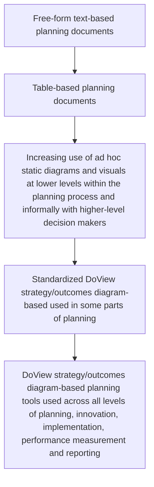

# DoView Tool B1 — Evolution of Use of Visual Models in Documents and Tools Used in Planning, Implementation and Reporting Explainer

> **Pair:** [Question](b01question.md) · Tool (this page)

Planning documentation has evolved from just using text-based documents to now involving interactive drill-down strategy/outcomes diagrams within government strategy, planning, implementation and reporting.

## Diagram

The top of the chain (`n1`–`n2`) reflects **traditional text-and-table-based documents**. The bottom (`n5`) reflects the **future**: visualization-based, standardized, interactive real-time drill-down strategy/outcomes diagrams. The middle bands (`n3`–`n4`) mark **NOW** — a transitional state where ad hoc diagrams and partial standardization coexist.

---

*Source: DOVIEW PLANNING AND PRACTICAL OUTCOMES THEORY HANDBOOK (2025). DoView Planning.Org. Copyright Dr Paul W Duignan.*
