# DoView Tool B3 — A Roadtrip Shown as a DoView Strategy/Outcomes Diagram Example

> **Pair:** [Question](b03question.md) · Tool (this page)

The 'Route 66 DoView Strategy/Outcomes Diagram' below illustrates how a 'This-Then' DoView strategy diagram works. Outcomes are on the right-hand side, and the steps that it is believed will lead to them are shown on the left. These diagrams can be built from bottom-to-top or from left-to-right. The left-to-right format has the advantage that it is a more natural format for those who speak languages that are read from left-to-right.

## Diagram

```mermaid
flowchart LR
    subgraph IL["Chicago, Illinois"]
        a1["Get car checked by a mechanic"]
        a2["Check driver's license"]
        a3["Sufficient maps and Route 66 travel guide"]
    end
    subgraph OK["Oklahoma"]
        b1["Check tire pressure"]
        b2["Check oil"]
        b3["Visit Blue Whale attraction in Catoosa"]
    end
    subgraph TX["Texas"]
        c1["Eat at the Route 66 Midway Cafe in Adrian"]
        c2["Visit Cadillac Ranch (half-buried Cadillacs)"]
        c3["Visit Aunt Sally"]
    end
    subgraph CA["Santa Monica, California"]
        d1["Have lots of fun on the way"]
        d2["Not be too stressed by the journey by rushing"]
        d3["Arrive in Santa Monica"]
    end
    IL --> OK --> TX --> CA
```

---

*Source: DOVIEW PLANNING AND PRACTICAL OUTCOMES THEORY HANDBOOK (2025). DoView Planning.Org. Copyright Dr Paul W Duignan.*
