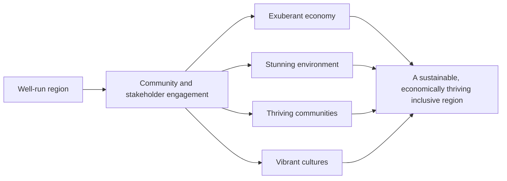

# DoView Tool B6 — A Real-World Interactive Drill-Down DoView Strategy/Outcome Diagram Example

> **Pair:** [Question](b06question.md) · Tool (this page)

An example of an interactive drill-down DoView strategy/outcomes diagram for regional development with the drilled-down subpage under the 'Exuberant economy' box shown.

## Diagram

### Regional Development Overview Page

### Drill-down page — Exuberant economy

---

*Source: DOVIEW PLANNING AND PRACTICAL OUTCOMES THEORY HANDBOOK (2025). DoView Planning.Org. Copyright Dr Paul W Duignan.*
