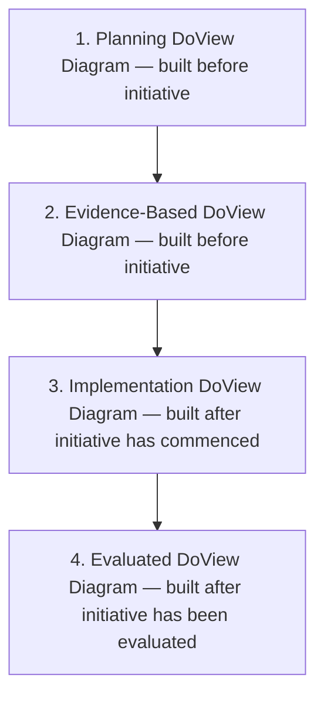

# DoView Tool B12 — Four Types of DoView Strategy/Outcomes Diagrams With Differing Evidential Status

> **Pair:** [Question](b12question.md) · Tool (this page)

This tool distinguishes between four different types of DoView strategy/outcomes diagrams for an agency, provider, policy, strategy or initiative based on the DoView's evidential status.

| # | Type | When built | What it does |
|---|---|---|---|
| 1 | Planning DoView Diagram | Ideally built before an initiative is undertaken | Sets out what it is hoped will happen in the forthcoming initiative in terms of outcomes and the steps it is believed will lead to them |
| 2 | Evidence-Based DoView Diagram | Ideally built before an initiative is undertaken | Validates the 'This-Then' logic of the DoView diagram against evidence from previous research and evaluation in the sector and/or expert peer review of the diagram |
| 3 | Implementation DoView Diagram | Built after an initiative has commenced (or an amended version of 1 or 2) | Sets out what it is believed is currently being implemented in an initiative (may include evidence from implementation and process evaluation) |
| 4 | Evaluated DoView Diagram | Built after an initiative has been evaluated | Uses evaluation findings from the initiative to show what actually happened during the implementation of the particular instance of the initiative |

## Diagram

---

*Source: DOVIEW PLANNING AND PRACTICAL OUTCOMES THEORY HANDBOOK (2025). DoView Planning.Org. Copyright Dr Paul W Duignan.*
