# DoView Tool B14 — Defining an Initiative's Outcomes Explainer

> **Pair:** [Question](b14question.md) · Tool (this page)

Below are a number of competing definitions of an initiative's 'outcomes'. Mark up in a DoView the boxes you regard as the initiative's outcomes, then everyone can see them in the context of the other boxes in the DoView.

## Diagram

The page shows the Archery Initiative DoView (a left-to-right drill-down to "Sufficient arrows hit the bulls-eye"), surrounded by six lettered competing definitions of 'outcomes' (A–F).

```mermaid
flowchart LR
    subgraph DoView["Archery Initiative DoView"]
        direction LR
        s1["Well trained archers / Good quality bows / Arrows sharp enough / Arrows light enough that they can potentially reach the bulls-eye"]
        s2["Arrows taken out of quiver fast enough / Arrows correctly notched onto the bow string / Bow string pulled back far enough"]
        s3["Correct target accurately identified / Arrows lined up with bullseye / Sufficient adjustment to aiming of arrows to allow for cross-winds"]
        s4["Sufficient number of arrows fired from bow"]
        s5["Arrows get past any barriers in the way"]
        s6["Arrows still heading in the right direction after passing any barriers"]
        s7["Arrows still flying three-quarters of the way up the range / Arrows still heading in the right direction three-quarters of the way up the range"]
        s8["Sufficient arrows hit the bulls-eye"]
        s1 --> s2 --> s3 --> s4 --> s5 --> s6 --> s7 --> s8
    end
```

### Competing definitions of 'outcomes'

- **A.** 'Outcomes are whatever boxes it can be proved have been improved by the initiative. Therefore it's 'true outcomes' cannot be identified until after impact evaluation has been done'.
- **B.** 'The initiative's actual 'outcome' is at this level because it is controllable and boxes further up are influenced by other factors'.
- **C.** 'Outcomes are boxes to the right of the model which are not outputs'.
- **D.** 'There is not a single type of outcome, there are immediate, intermediate and final outcomes or short-term, medium-term and long-term outcomes.'
- **E.** 'Outcomes are specified high-level boxes on the right-hand-end of any DoView diagram' (DoView Planning 'outcome' definition).
- **F.** 'Whatever else they might be, outcomes have to be currently quantifiable and/or controllable'.

Additional annotation: 'Outcomes are things that happen in the 'outside world' not in the initiative itself'.

---

*Source: DOVIEW PLANNING AND PRACTICAL OUTCOMES THEORY HANDBOOK (2025). DoView Planning.Org. Copyright Dr Paul W Duignan.*
