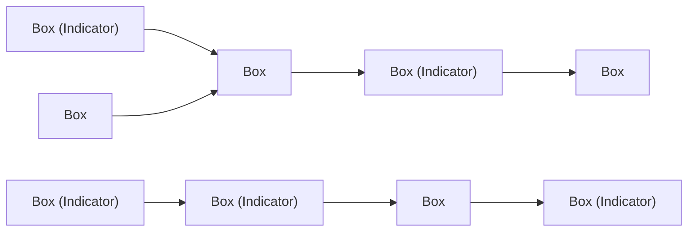

# DoView Tool B15 — Including Currently Non-Quantifiable Steps and Outcomes in Strategy/Outcomes Diagrams & Outcomes Frameworks Explainer

> **Pair:** [Question](b15question.md) · Tool (this page)

Some approaches to identifying an initiative's steps and outcomes (or objectives) only let you include currently quantifiable steps and outcomes. For instance, the SMART approach to objective setting specifies that objectives have to be Specific, Measurable, Achievable, Relevant and Time-based. In contrast to this, DoView Planning's DoView Drawing Rules (B7) do not require that all steps and outcomes within DoView strategy/outcomes diagrams be currently quantifiable. This approach means you have an easy way of talking about strategic risks and opportunities regardless of whether you can currently quantify them or not.

The boxes below which do not have indicators next to them are currently not-quantifiable, but they can still be discussed in strategy meetings if you have included them in your strategy/outcomes diagram or outcomes framework.

## Diagram

A generic left-to-right DoView with three columns of boxes. Some boxes carry an "Indicator" tag (currently quantifiable); others have no tag (currently non-quantifiable but still included for strategic discussion).

Boxes labelled "(Indicator)" are currently quantifiable; boxes without that label are currently non-quantifiable but are kept in the diagram so they can still be discussed in strategy meetings.

---

*Source: DOVIEW PLANNING AND PRACTICAL OUTCOMES THEORY HANDBOOK (2025). DoView Planning.Org. Copyright Dr Paul W Duignan.*
