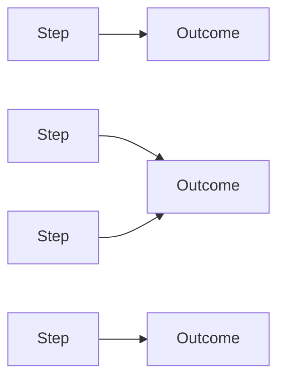
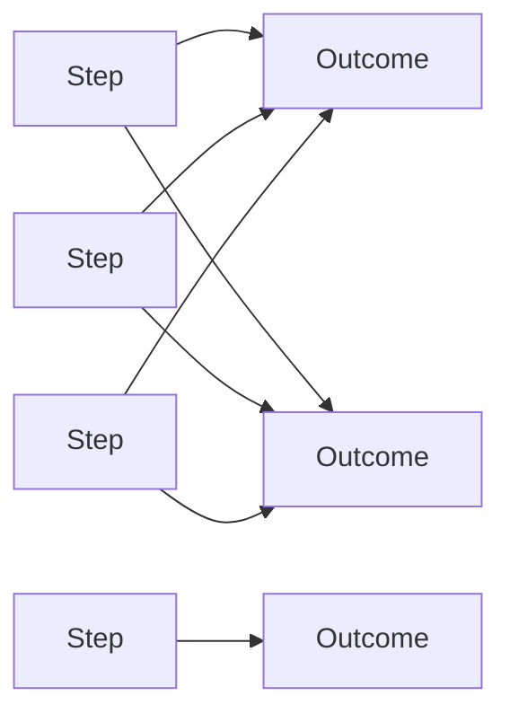

# DoView Tool B16 — Do Not Silo Steps Under Outcomes Explainer

> **Pair:** [Question](b16question.md) · Tool (this page)

The difference between siloing and not siloing steps under outcomes is shown below. In some types of outcomes frameworks steps (strategies, projects, activities) are forced to be 'siloed' under individual higher-level outcomes ('A' below). You can end up doing this inadvertently when using a table format for outcomes and strateges and not a strategy to be allocated to more than one outcome. This is a technical mistake because it prevents you communicating the reality that steps can potentially influence more than one high-level outcome. This is called 'many-to-many' modeling. DoView strategy /outcomes diagrams built according to the DoView Drawing Rules (B7) do not suffer from a siloing problem ('B' Below).

## Diagram

### A — Siloed (each step links to only one outcome)

### B — Not siloed (steps can link to multiple outcomes; many-to-many)

---

*Source: DOVIEW PLANNING AND PRACTICAL OUTCOMES THEORY HANDBOOK (2025). DoView Planning.Org. Copyright Dr Paul W Duignan.*
