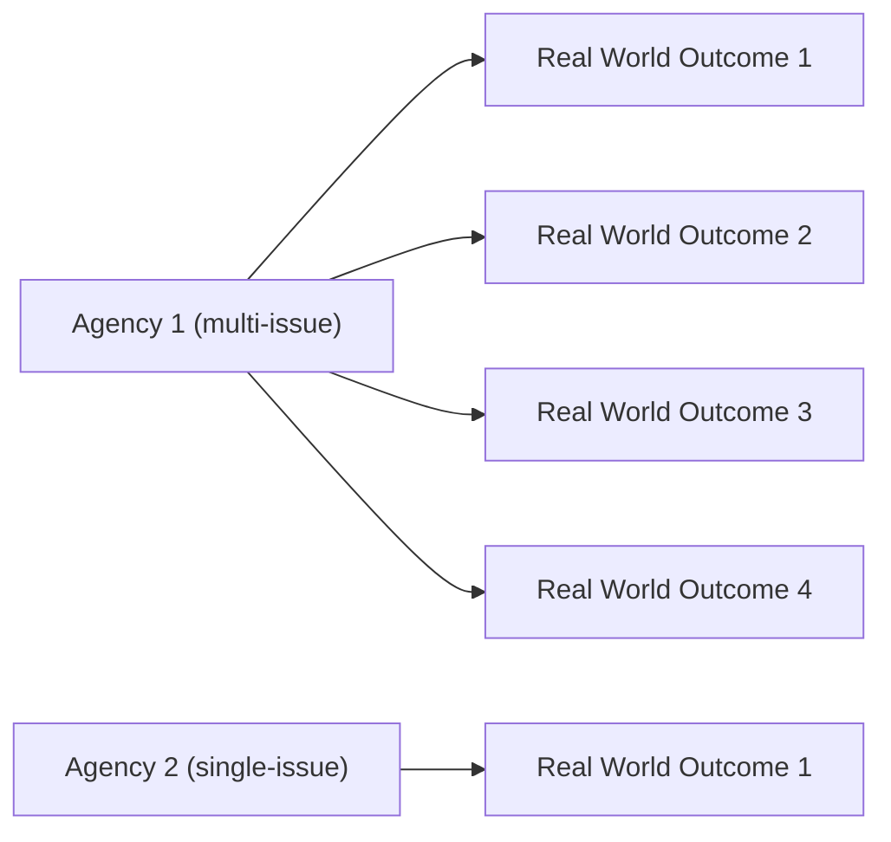
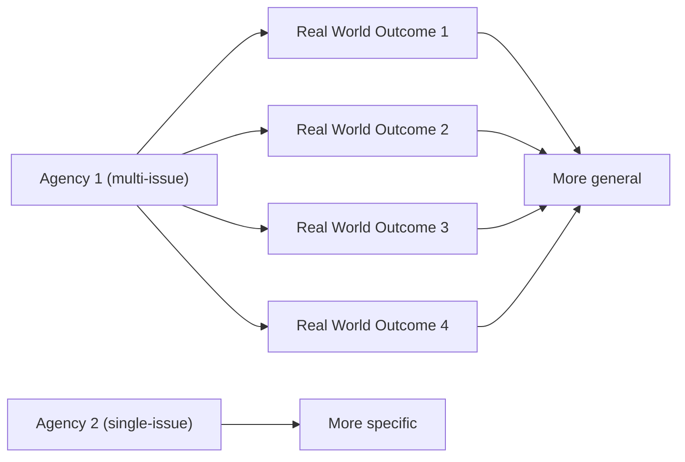

# DoView Tool B17 — Effects of Limiting the Number of an Agency or Initiative's Outcomes Explainer

> **Pair:** [Question](b17question.md) · Tool (this page)

Agency 1 is a multi-issue agency with many outcome areas in the outside world, but Agency 2 has only a single outcome area - and this is accurately represented in 'A' below. Demanding that both agencies have only a single outcome will mean that the single top-level outcome for Agency 1 will necessarily be more general than the top-level outcome for Agency 2 - as shown in 'B' below. Therefore, the two agencies' outcomes will not be at the same level of generality. By representing outcomes in the form of DoView strategy/outcomes diagrams allowing any number of boxes at any level, the reader can see if this is happening. Seeing the lower levels of the outcomes structure means that they can immediately understand the level at which various outcomes have been struck, even if the number of outcomes allowed at the top level has been limited.

## Diagram

### A — Where agencies can have as many outcomes as the outside world requires

### B — Consequences of demanding agencies have a single outcome

Forcing both agencies to a single top-level outcome makes Agency 1's outcome **more general** (it has to encompass four real-world issues) while Agency 2's stays **more specific** — so the two are no longer struck at the same conceptual level.

---

*Source: DOVIEW PLANNING AND PRACTICAL OUTCOMES THEORY HANDBOOK (2025). DoView Planning.Org. Copyright Dr Paul W Duignan.*
