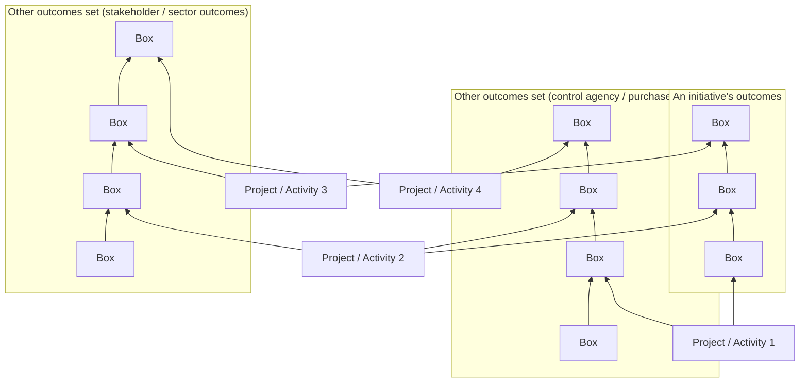

# DoView Tool B18 — How An Initiative Can Deal With Multiple 'Outcomes Sets' Tool

> **Pair:** [Question](b18question.md) · Tool (this page)

Government agencies, providers, policies, organizations and initiatives are often required to show how their work relates to a number of different 'outcomes sets'. These are called things such as: outcomes, standards, requirements, best practice, quality certification, targets, goals etc. They can come from different control agencies, purchasers, funders or stakeholders, they may also be 'sector-wide outcomes'. This can be time-consuming. An initiative can also get confused about the 'best' set of outcomes to structure its internal outcomes documentation.

In DoView Planning, an initiative's activities or projects can be mapped onto any number of different outcomes sets. This is because all of them, including the initiative's own outcomes set, can be represented as boxes within a DoView strategy/outcomes diagram. Once they get used to this way of working, control agencies, purchasers, funders, and others can come to realize that it is a more efficient approach. The initiative just sends them a DoView strategy/outcomes diagram showing DoView Visual Alignment and they can immediately see if it is focused on their particular outcomes.\*

## Diagram

The page shows three separate small DoView strategy/outcomes diagrams across the top — the initiative's own outcomes set on the left and two further outcomes sets to the right (representing those required by control agencies, purchasers, funders, other stakeholders or 'sector' outcomes). Below them is a row of boxes representing the initiative's projects or activities. Each project/activity is linked upward by arrows to the specific boxes it is focused on across all three outcomes sets — illustrating DoView Visual Alignment with multiple outcomes sets simultaneously.

\* If an app or platform with the right features such as the DoView legacy app is used, the control agency, purchaser or funder can interact with the DoView to deepen their understanding of the extent of the initiative's alignment with their outcomes. Where there are many linkages, AI can also be used to validate the claimed alignment.

---

*Source: DOVIEW PLANNING AND PRACTICAL OUTCOMES THEORY HANDBOOK (2025). DoView Planning.Org. Copyright Dr Paul W Duignan.*
