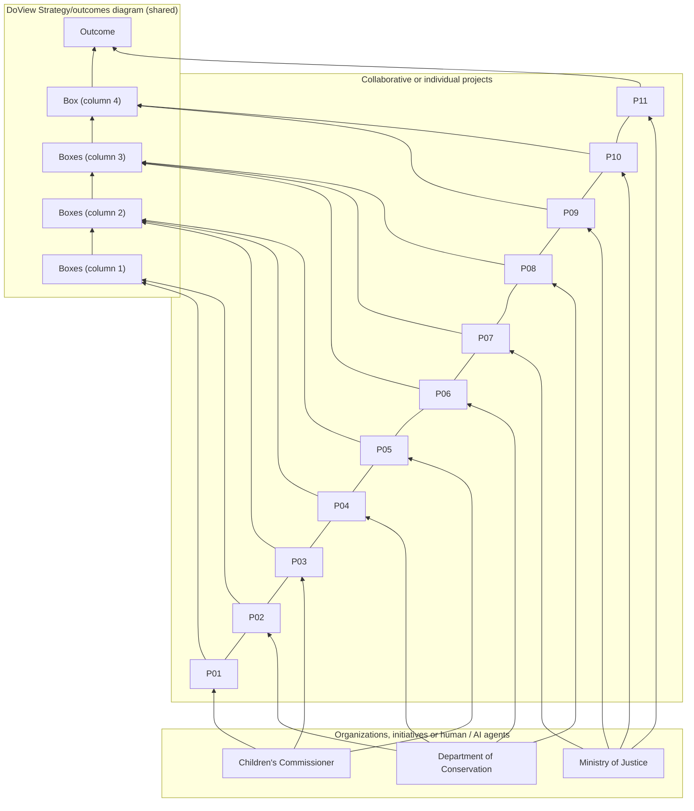

# DoView Tool B19 — Multiple Initiatives or Agents With Shared Outcomes DoView Diagram Coordination

> **Pair:** [Question](b19question.md) · Tool (this page)

## Diagram

The page is a three-tier visual alignment diagram. The top tier is a shared cross-agency DoView strategy/outcomes diagram (a left-to-right drill-down of grouped boxes). The middle tier shows eleven collaborative or individual projects (P01–P11). The bottom tier shows the contributing organizations, initiatives or human/AI agents (the page illustrates three: Children's Commissioner, Department of Conservation, and Ministry of Justice). Arrows from the bottom tier go up to the projects each agent is part of, and arrows from the projects go up to the boxes in the shared DoView each project is focused on — making the cross-agency line-of-sight visible.

The three layers — DoView strategy/outcomes diagram (top), collaborative or individual projects (middle), and organizations / initiatives / human or AI agents (bottom) — let everyone see at a glance which agents are contributing through which projects to which shared steps and outcomes.

---

*Source: DOVIEW PLANNING AND PRACTICAL OUTCOMES THEORY HANDBOOK (2025). DoView Planning.Org. Copyright Dr Paul W Duignan.*
