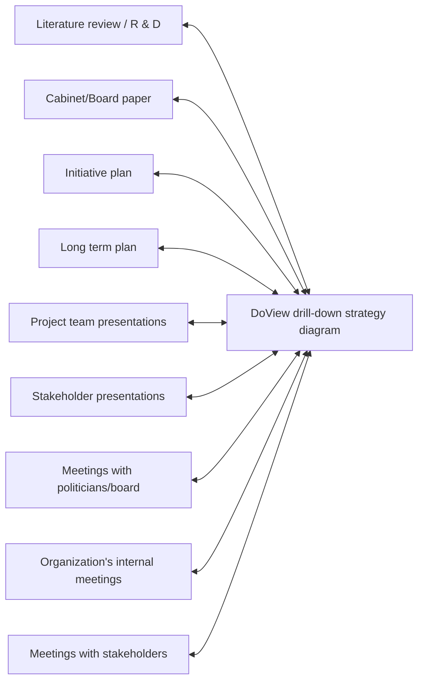

# DoView Tool B2 — DoView Strategy/Outcomes Diagrams as 'Shared Thinking Tools' Explainer

> **Pair:** [Question](b2question.md) · Tool (this page)

In 'B' 'strategy' is captured and worked on in one place — a DoView drill-down strategy/outcomes diagram that acts as an external 'shared thinking artifact' or 'shared thinking tool' to reduce the cognitive load of the strategy task.

## Diagram

### A — Strategy scattered across many separate documents and meetings

In 'A' strategy is scattered across many different documents, meetings and presentations.

### B — Strategy captured in one shared thinking tool

In 'B' the DoView drill-down strategy diagram sits at the centre and feeds into (and is updated from) every document, presentation and meeting in the organization's strategy work.

---

*Source: DOVIEW PLANNING AND PRACTICAL OUTCOMES THEORY HANDBOOK (2025). DoView Planning.Org. Copyright Dr Paul W Duignan.*
