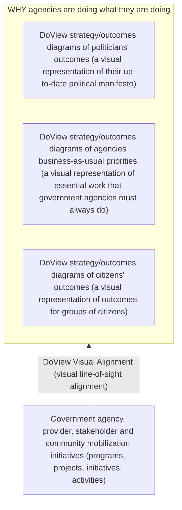

# DoView Tool B21 — Politicians, Government Agency Business-As-Usual and Citizens' Outcomes Integration Tool

> **Pair:** [Question](b21question.md) · Tool (this page)

Shown below is how politicians' outcomes, government agency business-as-usual outcomes and citizens' outcomes can be integrated into a set of DoView strategy/outcomes diagrams. In some cases, these can be combined into a single integrated strategy/outcomes diagram - for instance by joining politicians' and agency business-as-usual strategy/outcomes diagrams together. You can then use other tools such as DoView Visual Alignment to map activities and projects onto the diagrams to show that you have alignment between agency or intiative activities and outcomes.

## Diagram

The bottom layer ("WHO, WHAT, WHERE, WHEN, $ activity being done by government agencies, providers, and communities") holds the actual activity. Government agency and provider activities and projects are mapped onto the three top-tier strategy/outcomes diagrams using DoView Visual Alignment to make sure there is visual line-of-sight alignment between activity and the politicians', business-as-usual and citizens' outcomes.

---

*Source: DOVIEW PLANNING AND PRACTICAL OUTCOMES THEORY HANDBOOK (2025). DoView Planning.Org. Copyright Dr Paul W Duignan.*
