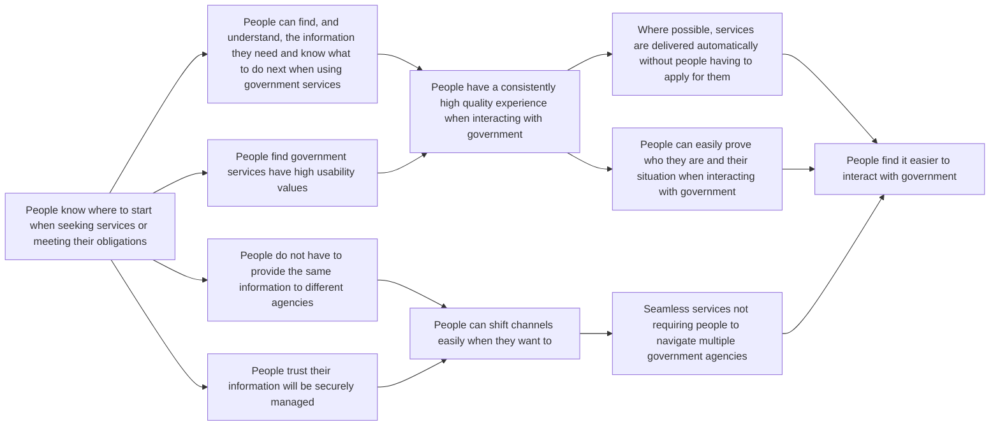
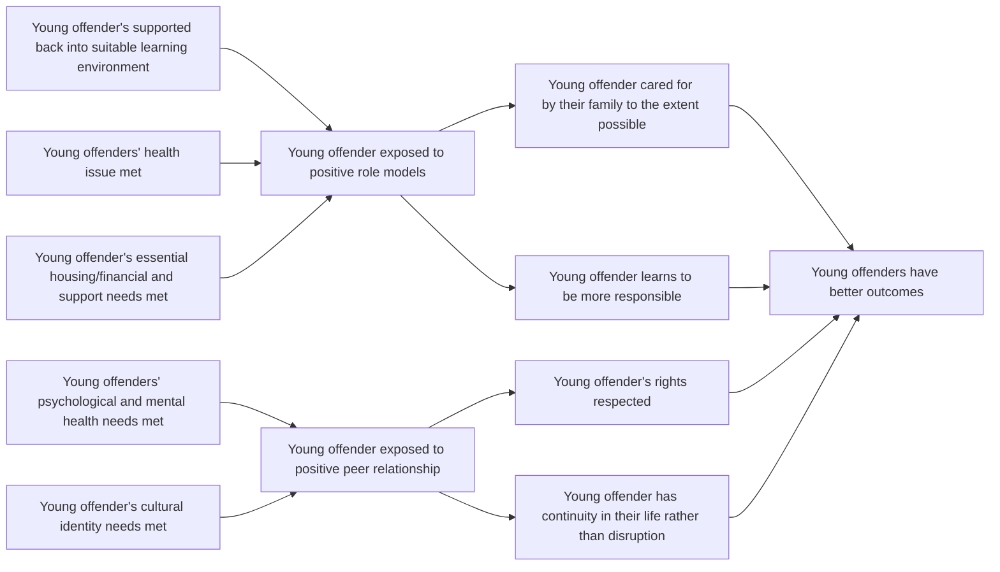

# DoView Tool B22 — Representing Citizen-Experience Maps As DoView Strategy Diagrams Explainer

> **Pair:** [Question](b22question.md) · Tool (this page)

Citizen-experience maps can be used to specifying citizen outcomes. You can represent them as a DoView strategy diagram. 'A' below is a DoView citizens-experience map for making it easier for all citizens to interact with government in a digital world. 'B' is a citizen-experience map for an example of where government wants to intervene with a particular group. In this case, preventing young offenders from continuing to offend with the hope that by doing so, this will reduce likely government expenditure in the future.

## Diagram

### A — Citizens-experience map: easier interaction with government in a digital world

### B — Citizens-experience map for young offenders

---

*Source: DOVIEW PLANNING AND PRACTICAL OUTCOMES THEORY HANDBOOK (2025). DoView Planning.Org. Copyright Dr Paul W Duignan.*
