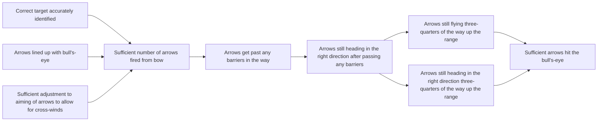
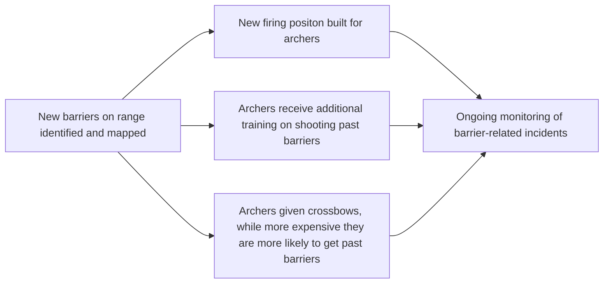

# DoView Tool B23 — DoView 'What-If' Planning

> **Pair:** [Question](b23question.md) · Tool (this page)

It is difficult to plan in times such as the present when we face convulsive change. Rather than decision-makers attempting to achieve a consensus on the likely future strategic environment, it is better to use DoView What-If Planning. In DoView-based scenario planning, you develop more than one DoView diagram or subpart of a DoView diagram, in addition to developing 'Switch Indicators'. When these indicators cross certain thresholds, they trigger you to change your 'Current What-If DoView' to an alternative one. You then use the alternative one as the basis for your ongoing strategy. Below, when the Switch Indicator reaches a threshold it triggers moving from What-If 1 DoView (A below) to What-If 2 DoView Subsection (B below) in the Archery Initiative DoView (B4).

## Diagram

### A — What-If 1: Business as Usual DoView

**Switch Indicator (M001):** Number of barriers on the range counted (functions as What-If Planning Switch Indicator triggering a switch to What-If 2 when number of barriers greater than 3.)

### B — What-If 2: Additional Barriers DoView Subsection

When M001 crosses its threshold, the Current What-If DoView switches from A to B and B becomes the basis for ongoing strategy.

---

*Source: DOVIEW PLANNING AND PRACTICAL OUTCOMES THEORY HANDBOOK (2025). DoView Planning.Org. Copyright Dr Paul W Duignan.*
