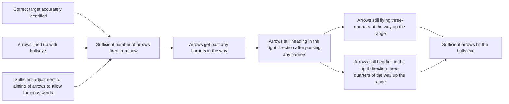
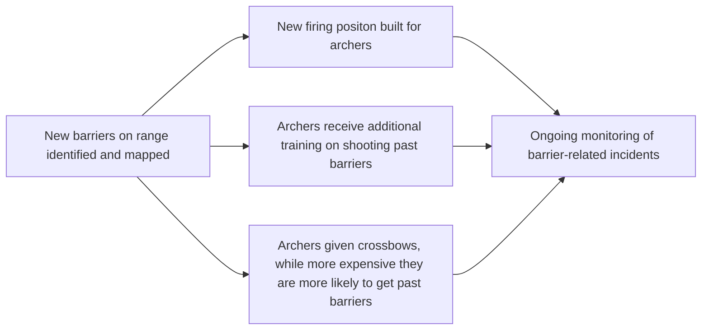
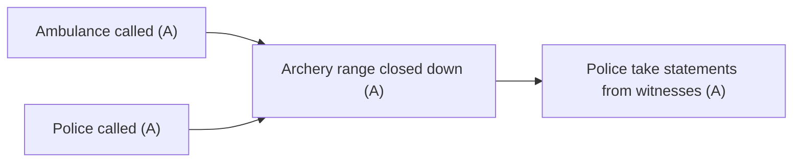

# DoView Tool B24 — Pre-Approved DoView Subsection Pathways in DoView 'What-If' Planning

> **Pair:** [Question](b24question.md) · Tool (this page)

In DoView What-If Planning (B23), when trigger indicators reach their threshold, you move to a new 'Current What-If DoView subsection' for planning and implementation. In some What-If DoView subsections, you have time to deliberate and decide which boxes to prioritize. If timing is tight when a particular What-If subsection is triggered, you can pre-approve a pathway to act fast. The Archery Initiative (B4) below shows three What-If DoView subsections: What-If 1: Business As Usual, What-If 2: Additional Barriers, and What-If 3: Person Shot on the Archery Range. In What-If 2, you have time to deliberate on which middle boxes are priorities. However, if What-If 3 is triggered, you implement all boxes as A priorities immediately in order to respond fast enough.

## Diagram

### What-If 1 — Business As Usual

### Switch Indicators

- **M001** — Number of barriers on the range counted (functions as What-If Planning Switch Indicator triggering a switch to What-If 2 when number of barriers greater than 3).
- **M002** — Someone is shot by an arrow on the archer range. A What-If Switch Indicator triggering switching to What-If 3 which has a pre-approved pathway of all boxes being A priorities which you immediately implement.

### What-If 2 — Additional Barriers (deliberate; prioritize as normal)

### What-If 3 — Person Shot on the Archery Range (pre-approved; all boxes are A priorities, implement immediately)

---

*Source: DOVIEW PLANNING AND PRACTICAL OUTCOMES THEORY HANDBOOK (2025). DoView Planning.Org. Copyright Dr Paul W Duignan.*
