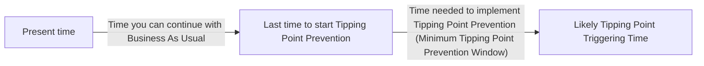
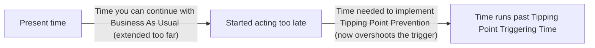

# DoView Tool B25 — Risk Estimation and Acting Before the Tipping Point Prevention Window Has Closed Explainer

> **Pair:** [Question](b25question.md) · Tool (this page)

In any case where you are dealing with irreversible tipping points, you need to act as in 'A' below before the Minimum Tipping Point Prevention Window closes. In 'B', you have acted too late, and the window has closed. To do this you to have the correct type of risk management estimates. They need to be estimates of the 'time by which it is likely that the risk has NOT BEEN TRIGGERED' rather than 'time by which it is likely that the risk HAS BEEN TRIGGERED' estimates. This typically involves adding a factor to your risk estimates to account for both known and unknown unknowns. You also need to have detailed your Tipping Point Prevention DoView so you can estimate how long it will take to implement it and then start working on it in time to be completed by the Tipping Point Triggering Time. 'C' shows the type of risk management estimate you need to effectively manage tipping point risks.

## Diagram

The page is a timeline diagram with three rows (A, B, C). Row A shows acting in time; row B shows acting too late; row C explains the two estimate types.

### A — Acting in time (window still open)

### B — Acting too late (window has closed)

### C — Two types of risk-management estimate

| Estimate type | Where the margin sits | What it optimises for |
|---|---|---|
| **A TIME BY WHICH IT IS LIKELY RISK HAS NOT BEEN TRIGGERED** | Margin on the *earlier* side | Conservative for action: ensures you are able to act in time. |
| **A TIME BY WHICH IT IS LIKELY RISK HAS BEEN TRIGGERED** | Margin on the *later* side | Conservative for being right: more certain that the tipping point has actually been triggered by the estimated time. |

For tipping-point risks, use the first estimate type so you start the Tipping Point Prevention DoView subsection before the Prevention Window closes.

---

*Source: DOVIEW PLANNING AND PRACTICAL OUTCOMES THEORY HANDBOOK (2025). DoView Planning.Org. Copyright Dr Paul W Duignan.*
