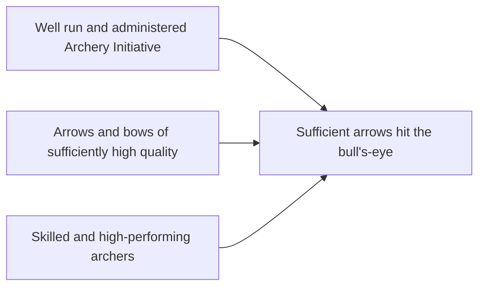

# DoView Tool B5 — Breaking Up DoView Strategy/Outcomes Diagrams Into Drill-Down Layers

> **Pair:** [Question](b5question.md) · Tool (this page)

For DoView strategy/outcomes diagrams to be able to be used at the heart of strategy, planning, innovation, implementation and reporting, they need to be able to be used right across all 'communications platforms' used in these settings. Ideally visual strategy diagrams will be optimized for use on the 'lowest common denominator' of communications platforms — when dataprojected or on a tablet. This lowest common denominator approach means that the same diagram can then be read and worked with on any larger-format communications platform. For instance, printed out on larger paper, seen electronically on larger desktop screens or all of the drill-down layers can be placed on a single poster version. 'A' below is the overview page of a Archery Initiative strategy/outcomes diagram. 'B' shows a single drill-down page for 'Skilled and high-performing archers' providing much more detail.

## Diagram

### A — Overview page

### B — Drill-down page for 'Skilled and high-performing archers'

---

*Source: DOVIEW PLANNING AND PRACTICAL OUTCOMES THEORY HANDBOOK (2025). DoView Planning.Org. Copyright Dr Paul W Duignan.*
