# DoView Tool B8 — Conventions for Representing DoView Strategy/Outcomes Diagrams

> **Pair:** [Question](b8question.md) · Tool (this page)

DoView strategy/outcomes diagrams are represented using a specific set of conventions. The aim is to ultimately develop a full visual language for articulating and working with strategy. Currently, the goal is to keep diagrams as simple as possible for broad accessibility. As more people use these diagrams and become more skilled, additional DoView drawing conventions will be added. The current conventions are as follows.

**Represent 'fuzzy causality'** — Just show general left to right causality and a single causal arrow between columns of boxes within a diagram as shown in the 'Archery Initiative' example (B4) below.

**Don't show feedback loops** — Instead put 'Not all links and feedback loops are shown' at the bottom of each subpage.

**Use filled and empty arrows** — A filled arrow is used in the DoView below for a 'This-Then' statement to indicate that at least one box in the column on the left causes at least one box in column (i.e. 'Well trained archers' causes 'Arrows taken out of quiver fast enough' in addition to the other two boxes in the second column. There is an unfilled arrow between the second column and the third column because it is an 'And' statement. None of the boxes in the third column are caused by the boxes in the middle column, they are caused by boxes in the first column. An 'And' statement can be seen as saying that the third column is a continuation of the second column but to fix it on the subpage it is more convenient to have it as another column.

## Diagram

```mermaid
flowchart LR
    subgraph col1["Inputs"]
        a1["Well trained archers"]
        a2["Good quality bows"]
        a3["Arrows sharp enough"]
        a4["Arrows light enough that they can potentially reach the bulls-eye"]
    end
    subgraph col2["Preparation"]
        b1["Arrows taken out of quiver fast enough"]
        b2["Arrows correctly notched onto the bow string"]
        b3["Bow string pulled back far enough"]
    end
    subgraph col3["Aim"]
        c1["Correct target accurately identified"]
        c2["Arrows lined up with bullseye"]
        c3["Sufficient adjustment to aiming of arrows to allow for cross-winds"]
    end
    col1 ==> col2
    col2 -.-> col3
```

Arrow legend: a thick filled arrow (`==>`) means 'If then'. A thin/empty arrow (`-.->`) means 'And' — the next column is a continuation rather than caused by the previous one.

*Not all links and feedback links shown.*

---

*Source: DOVIEW PLANNING AND PRACTICAL OUTCOMES THEORY HANDBOOK (2025). DoView Planning.Org. Copyright Dr Paul W Duignan.*
