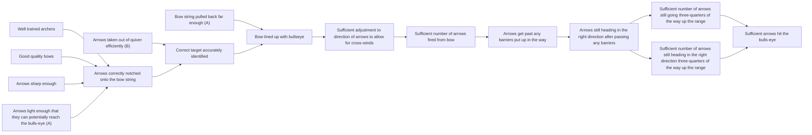

# DoView Tool C2 — Traditional Strategic Planning Priority Setting Versus Using a DoView Strategy/Outcomes Diagram

> **Pair:** [Question](c02question.md) · Tool (this page)

The traditional strategic planning approach of identifying priority strategies using the 'Archery Initiative' is shown in 'A'. If you are asked to critique this list of priorities within a normal text-based strategic plan, you have to have an implicit strategy/outcomes diagram in your head to identify alternative priorities. 'B' shows the DoView Planning approach where you build a DoView strategy/outcomes diagram that includes all wide set of possible steps (boxes) you might use. You then select your current priorities from amongst these boxes. Critiquing this is easy because you can immediately see the boxes that have NOT been selected as priorities and ask questions such as: 'Why is 'training and bow quality' not a priority at the moment?'

## A — Current strategic priorities as set out in a traditional text-based strategic plan

- Priority: Arrows light enough that they can potentially reach the bulls-eye
- Priority: Arrows taken out of quiver efficiently
- Priority: Bow string pulled back far enough

## B — A DoView strategy/outcomes diagram allows you to also query why boxes have not been made a priority

Looking at the DoView immediately prompts questions such as: 'Why are training and bow quality' not a priority at the moment?'

---

*Source: DOVIEW PLANNING AND PRACTICAL OUTCOMES THEORY HANDBOOK (2025). DoView Planning.Org. Copyright Dr Paul W Duignan.*
