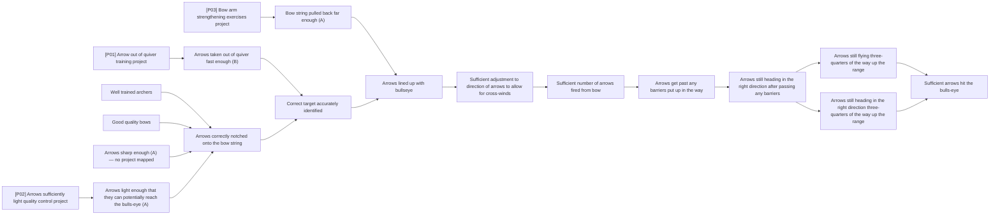

# DoView Tool C3 — DoView Visual Alignment

> **Pair:** [Question](c03question.md) · Tool (this page)

Below the 'Archery Initiative's' projects have been mapped onto the initiative's DoView strategy/outcomes diagram to check for 'line-of-sight' alignment. There is a lack of alignment for the gray 'A' priority box 'Arrows sharp enough' because no projects are mapped onto it. Either it is not a priority, or it should have one or more projects mapping onto it.

## Diagram

---

*Source: DOVIEW PLANNING AND PRACTICAL OUTCOMES THEORY HANDBOOK (2025). DoView Planning.Org. Copyright Dr Paul W Duignan.*
