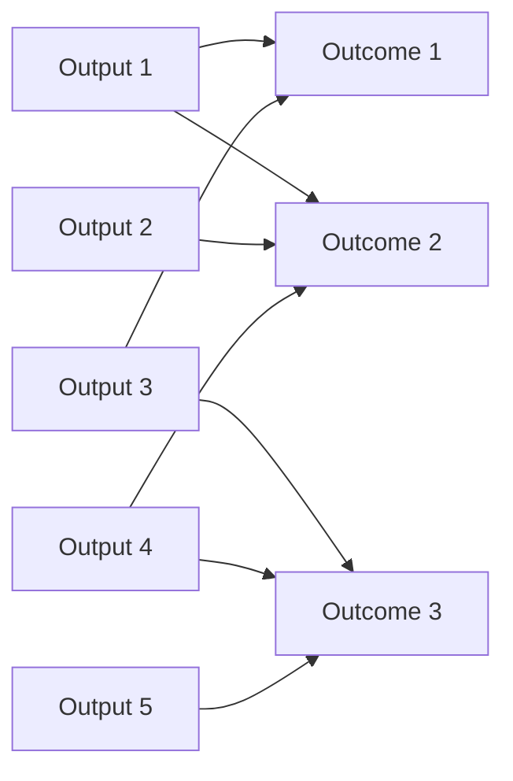

# DoView Tool C6 — How to Represent Outcomes and Outputs/Deliverables in Order to Determine Alignment

> **Pair:** [Question](c06question.md) · Tool (this page)

In reporting documents (for instance, for a government agency), you typically get separate lists of 'outcomes' and 'outputs' ('deliverables'). Those writing such reports don't think that outputs meet the definition of outcomes, so they exclude them from lists of outcomes. Then, in accordance with accounting standards, 'not-necessarily controllable outcomes' are not included in output lists because merely measuring that they have happened does not prove a particular organization or initiative made them happen. Hence, they are not 'attributable' and therefore not good candidates as accountability measures within an outputs list. One can understand this reasoning; however, having separate outcomes and outputs lists in such reports means it is often difficult, if not impossible, to easily check for alignment between outputs and outcomes. Checking this requires an integrated representation of some sort that shows which outputs are focused on which outcomes. 'A' below shows a list of outcomes from a government agency report. 'B' shows a separate list of outputs. 'C' shows how DoView Visual Alignment has been used to show the relationship of outputs to outcomes.

## A — Separate Outcomes List

- Outcome 1
- Outcome 2
- Outcome 3

## B — Separate Outputs (Deliverables) List

- Output 1
- Output 2
- Output 3
- Output 4
- Output 5

## C — Representation Showing Both and the Relationship Between Them

The illustrative diagram shows outputs on the left mapped onto outcomes on the right, with multiple line-links between them to indicate which outputs are believed to influence which outcomes.

---

*Source: DOVIEW PLANNING AND PRACTICAL OUTCOMES THEORY HANDBOOK (2025). DoView Planning.Org. Copyright Dr Paul W Duignan.*
