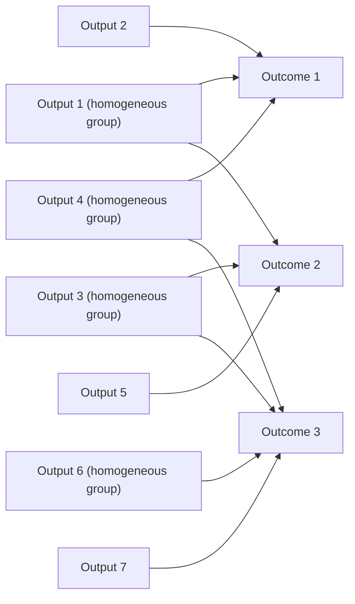
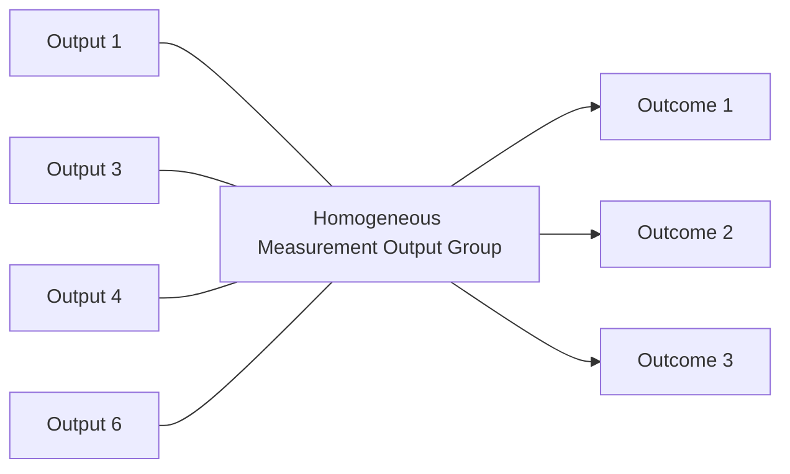

# DoView Tool C8 — Problem with Measurement-Homogeneous Output (Deliverable) Groups Obscuring The Links Between Individual Outputs and Outcomes Explainer

> **Pair:** [Question](c08question.md) · Tool (this page)

In some outcomes systems, outputs (deliverables) are grouped into output groups based on the outputs being able to be measured in similar ways. This is to make it easier and quicker to measure whether a large group of outputs has been delivered. However, if only a 'homogeneous measurement output groups' relationship with higher-level outcomes is reported on, the detailed DoView Visual Alignment information, which could be captured within a DoView strategy/outcomes diagram shown in 'A' will be lost. This happens if only representation 'B' is available. This is because 'B' does not show the detail of which grey outputs 1, 3, 4, 6 (only grouped because they are all measured in the same way) are linked to which outcomes.

## A — Full DoView Visual Alignment (individual outputs to outcomes)

## B — Only the homogeneous group → outcomes link is shown (detail lost)

In B, you can no longer tell which individual grey outputs (1, 3, 4, 6) are aligned to which outcomes — the fine-grained alignment information has been hidden by reporting only at the group level.

---

*Source: DOVIEW PLANNING AND PRACTICAL OUTCOMES THEORY HANDBOOK (2025). DoView Planning.Org. Copyright Dr Paul W Duignan.*
