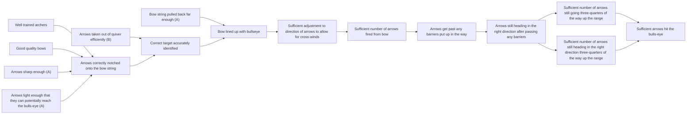

# DoView Tool C1 — Setting Priorities Onto a Strategy/Outcomes Diagram

> **Pair:** [Question](c1question.md) · Tool (this page)

The boxes in the illustrative strategy/outcomes diagram for an 'Archery Initiative' have been marked to show 'A' and 'B' priorities. Priority setting is based on: 1) identifying steps that ideally need to be improved within the current planning period; and, 2) available resources taking into account all of the potential priorities in 1 above.

## Diagram

Priority chips on the diagram: **A** — Arrows sharp enough; Arrows light enough that they can potentially reach the bulls-eye; Bow string pulled back far enough. **B** — Arrows taken out of quiver efficiently.

---

*Source: DOVIEW PLANNING AND PRACTICAL OUTCOMES THEORY HANDBOOK (2025). DoView Planning.Org. Copyright Dr Paul W Duignan.*
