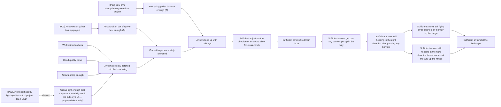

# DoView Tool C5 — Baseline Review Undertaken Against a DoView Strategy/Outcomes Diagram

> **Pair:** [Question](c5question.md) · Tool (this page)

A 'baseline review' of an 'Archery Initiative' can be undertaken against an existing DoView strategy/outcomes diagram. This baseline review is recommending the current 'A' priority 'Arrows light enough that they can potentially reach the bull's-eye' is no longer be a priority to because it is believed arrow weights are not currently a limiting factor. Therefore the relevant project [P02] can be de-funded. A baseline review working from an existing DoView diagram is a more efficient and transparent process than just relying on the baseline review team's mental model of the steps and outcomes that should be pursued.

## Diagram

De-fund project [P02] because the box it is focused on is no longer a priority.

---

*Source: DOVIEW PLANNING AND PRACTICAL OUTCOMES THEORY HANDBOOK (2025). DoView Planning.Org. Copyright Dr Paul W Duignan.*
