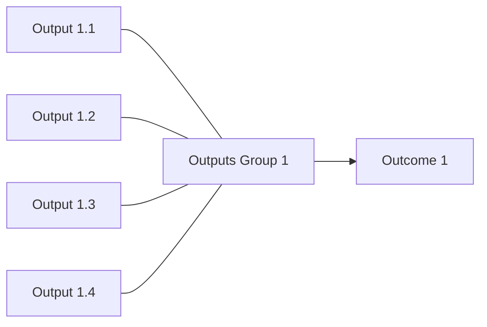
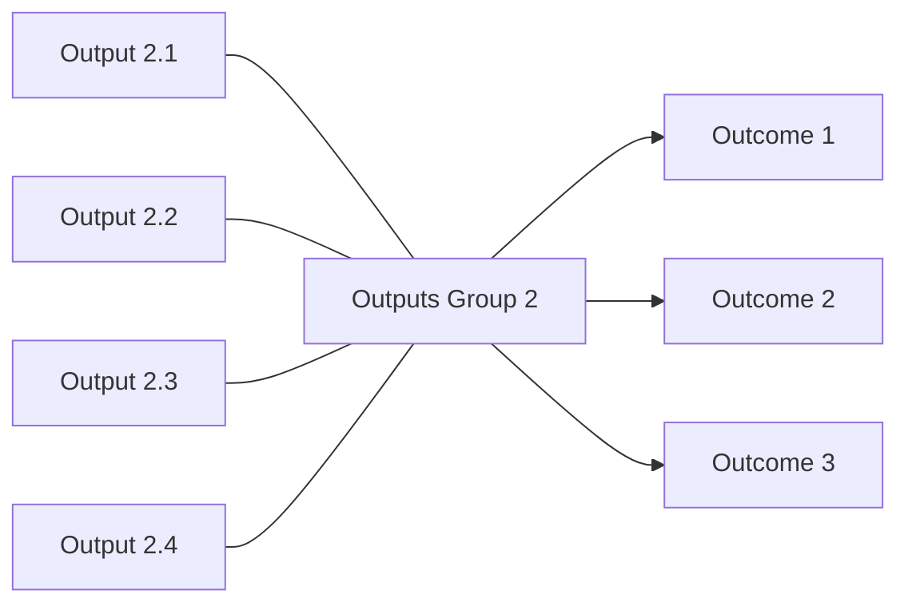
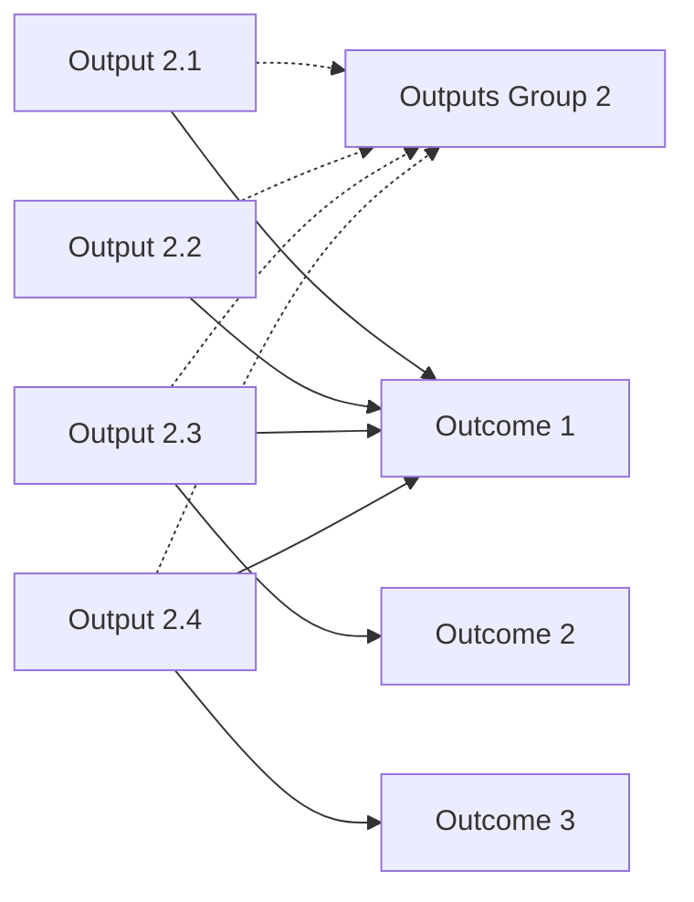

# DoView Tool C7 — Outputs/Deliverables Groupings Hiding Links Between Individual Outputs and Outcomes Explainer

> **Pair:** [Question](c7question.md) · Tool (this page)

'A' shows a group of outputs (deliverables) where all of the individual outputs just happen to focus on influencing a single outcome (Outcome 1). In such a case, only showing the relationship between Output Group 1 and the higher-level Outcome 1 does not hide which outputs are focused on which outcome(s). However, in 'B', the outputs in Output Group 2 focus on multiple outcomes, but which outputs focus on which outcomes is hidden. Therefore, it is impossible to rigorously determine the extent of line-of-sight alignment. There might be only a single individual output that is focused on Outcomes 2 and 3, or there may be more. The only way to deal with this is in 'C', which shows the full fine-grained DoView strategy/outcomes diagram showing all of the connections between individual outputs and high-level outcomes. So, from the representation in C, for instance, you can check alignment and see that the outputs in Output Group 2 focus more on Outcome 1 than on Outcomes 2 or 3.

## A — Single-outcome group (no information loss)

## B — Multi-outcome group, individual links hidden

## C — Full fine-grained DoView showing every individual link

In this fine-grained version you can check alignment directly: the outputs in Output Group 2 focus more on Outcome 1 than on Outcomes 2 or 3.

---

*Source: DOVIEW PLANNING AND PRACTICAL OUTCOMES THEORY HANDBOOK (2025). DoView Planning.Org. Copyright Dr Paul W Duignan.*
