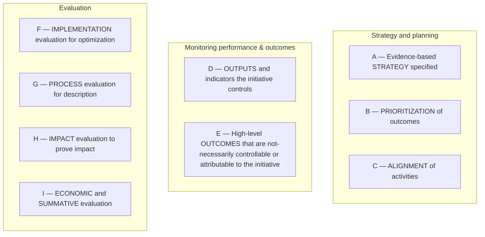

# DoView Tool D1 — DoView Planning Framework (Outcomes System Components/Building Blocks Diagram)

> **Pair:** [Question](d01question.md) · Tool (this page)

This tool shows a comprehensive list of the components needed in any strategy, alignment, indicators, deliverables, accountability, evaluation and value for money work. Just as accounting systems have to have particular building blocks (e.g. a general ledger and a depreciation schedule), so well-formed outcomes systems need to have the key building blocks set out in the DoView Planning Framework.

## Diagram

| Band | Components |
|---|---|
| Strategy and planning | A. Evidence-based strategy specified · B. Prioritization of outcomes · C. Alignment of activities |
| Monitoring performance & outcomes | D. Outputs and indicators the initiative controls · E. High-level outcomes that are not-necessarily controllable or attributable to the initiative |
| Evaluation | F. Implementation evaluation for optimization · G. Process evaluation for description · H. Impact evaluation to prove impact · I. Economic and summative evaluation |

---

*Source: DOVIEW PLANNING AND PRACTICAL OUTCOMES THEORY HANDBOOK (2025). DoView Planning.Org. Copyright Dr Paul W Duignan.*
