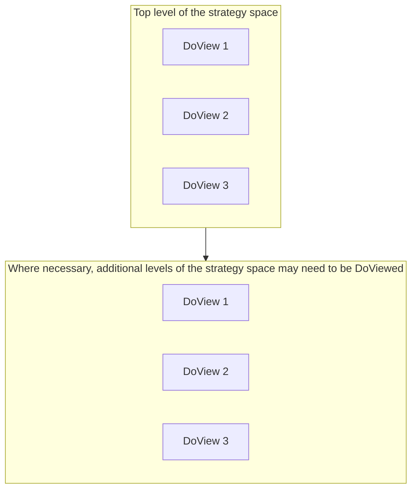

# DoView Tool D4 — The Role of Outcomes Architecture in the Design of Planning, Implementation, Measurement and Reporting Systems

> **Pair:** [Question](d04question.md) · Tool (this page)

If organizations, strategies, policies or initiatives are going to be well-formed they need to include within them the key outcomes system building block components set out in the DoView Planning Framework (D1). An outcomes architect uses the DoView Drawing Rules (B7) together with the Strategy and Outcomes System Terminology Explainer (D2) to work out if a particular outcomes system has included within it all of Framework building blocks; which party will undertake them; and, that they are sufficiently integrated so that the organization or initiative is truly outcomes-driven. Many organizations or initiatives will just have a single DoView. However, for larger organizations and initiatives, collaborations, joint ventures, sectors and whole governments, there will need to be a suite of DoView diagrams.

## Diagram

An outcomes architect makes sure that DoViews at any level within a suite of DoView strategy/outcomes diagrams cover the strategy space but do not overlap too much.

The illustrative diagram shows two horizontal bands of overlapping rectangles. The top band represents the top level of the strategy space, partially covered by DoView 1, DoView 2 and DoView 3 (with their edges overlapping slightly). The lower band represents additional, deeper levels where DoView 3, DoView 2 and DoView 1 again provide overlapping coverage. Beneath the diagram, four cues run left-to-right: **Speak to stakeholders**, **Speak to decision-makers**, **Speak to implementers**, and **World-centric not organization or initiative-centric** — the perspectives the outcomes architect must consult when deciding the suite's composition.

---

*Source: DOVIEW PLANNING AND PRACTICAL OUTCOMES THEORY HANDBOOK (2025). DoView Planning.Org. Copyright Dr Paul W Duignan.*
