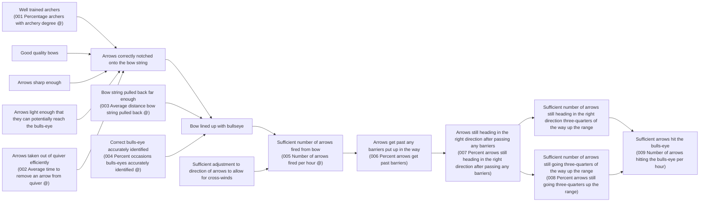

# DoView Tool D10 — Developing or Reviewing an Indicators, Deliverables, Outputs or KPIs List

> **Pair:** [Question](d10question.md) · Tool (this page)

To develop, or review, a deliverables list, build the relevant DoView strategy/outcomes diagram as in 'A' below using the DoView Drawing Rules (B7). Then select relevant deliverables using the Deliverables, Outputs and KPIs Checklist (D9) — the ones below with an '@' next to them. If reviewing the deliverables list given in 'B' below, simply draw the relevant DoView strategy/outcomes diagram in the same way as in 'A'. From this, you might conclude that indicators 1 and 2 are subsumed by 4 (quality) and 5 (quantity), so you might only use 4 and 5. Also, that indicator 9, because it is not-necessarily controllable, should not be in a deliverables list if you are using controllables-only contracting (Types 1 - 3) in the Types of Contracting for Outcomes Or Outputs (E3).

## Diagram

### A — DoView strategy/outcomes diagram with indicators

`@` = Controllable indicators.

### B — Deliverables list being reviewed

- 001 Percentage archers with archery degree @
- 002 Average time to remove an arrow from quiver @
- 004 How many occasions bulls-eyes accurately identified @
- 005 Number of arrows fired per hour @
- 009 Number of arrows hitting the bulls-eye per hour

---

*Source: DOVIEW PLANNING AND PRACTICAL OUTCOMES THEORY HANDBOOK (2025). DoView Planning.Org. Copyright Dr Paul W Duignan.*
