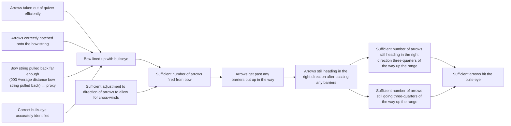
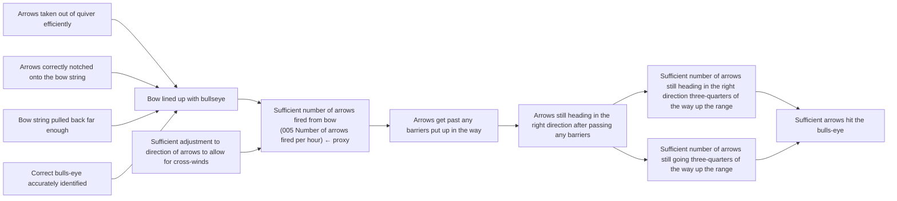

# DoView Tool D11 — Proxy Indicator Level-Assessment Tool

> **Pair:** [Question](d11question.md) · Tool (this page)

This tool shows the importance of revealing the level at which proxy indicators are located within the relevant DoView strategy/outcomes diagram. Proxy or surrogate indicators are indicators that are lower down a DoView diagram because you cannot find a suitable indicator at a higher level. You can assess the level of the two proxy indicators as shown below because they are shown against a DoView strategy/outcomes diagram. You can see that the proxy indicator shown in 'B' is higher up the diagram than the one that is shown in 'A'.

## Diagram

### A — Proxy indicator lower down the strategy diagram

Indicator `003 Average distance bow string pulled back` is attached to the low-level "Bow string pulled back far enough" box.

### B — Proxy indicator higher up the strategy diagram

Indicator `005 Number of arrows fired per hour` is attached to the higher-level "Sufficient number of arrows fired from bow" box.

The proxy in B sits closer to the desired top-level outcome ("Sufficient arrows hit the bulls-eye") than the proxy in A, making it a better proxy indicator.

---

*Source: DOVIEW PLANNING AND PRACTICAL OUTCOMES THEORY HANDBOOK (2025). DoView Planning.Org. Copyright Dr Paul W Duignan.*
