# DoView Tool D12 — Suspiciously Tidy Indicator Set Explainer

> **Pair:** [Question](d12question.md) · Tool (this page)

Some indicator sets look very tidy, such as in 'A' below with three outcomes and five indicators under each outcome. It is however unlikely that the indicators under each outcome in the set will be at a similar level within the initiative's DoView strategy/outcomes diagram. 'B' shows the boxes the indicators are measuring put onto the relevant DoView diagram. In this very stylized example, the boxes whose indicators relate to Outcome X tend to be much lower level than those for Outcome Y.

## Diagram

### A — A 'tidy' indicator set: three outcomes, five indicators each

| Outcome X | Outcome Y | Outcome Z |
|---|---|---|
| Indicator X1 | Indicator Y1 | Indicator Z1 |
| Indicator X2 | Indicator Y2 | Indicator Z2 |
| Indicator X3 | Indicator Y3 | Indicator Z3 |
| Indicator X4 | Indicator Y4 | Indicator Z4 |
| Indicator X5 | Indicator Y5 | Indicator Z5 |

### B — The same indicators mapped onto the underlying DoView strategy/outcomes diagram

The boxes whose indicators relate to Outcome X cluster on the left (lower-level steps); the boxes whose indicators relate to Outcome Y are spread further to the right (higher-level outcomes); Outcome Z's indicators are on the far right.

```mermaid
flowchart LR
    subgraph col1["Lowest-level steps"]
        X1["X1 (M X1)"]
        X2["X2 (M X2)"]
        X3["X3 (M X3)"]
        Y1["Y1 (M Y1)"]
    end
    subgraph col2[" "]
        X4["X4 (M X4)"]
        X5["X5 (M X5)"]
        Y2["Y2 (M Y2)"]
    end
    subgraph col3[" "]
        Y3["Y3 (M Y3)"]
        Z1["Z1 (M Z1)"]
        Y4["Y4 (M Y4)"]
    end
    subgraph col4[" "]
        Z2["Z2 (M Z2)"]
        Y5["Y5 (M Y5)"]
    end
    subgraph col5[" "]
        Z3["Z3 (M Z3)"]
    end
    subgraph col6[" "]
        Z4["Z4 (M Z4)"]
        Z5["Z5 (M Z5)"]
    end
    subgraph col7["Top-level outcomes"]
        OX["Outcome X"]
        OY["Outcome Y"]
        OZ["Outcome Z"]
    end

    col1 --> col2 --> col3 --> col4 --> col5 --> col6 --> col7
```

`M` denotes the measurement (indicator) attached to a box. The mapping shows that what looks tidy in 'A' is in fact uneven once the underlying levels are revealed.

---

*Source: DOVIEW PLANNING AND PRACTICAL OUTCOMES THEORY HANDBOOK (2025). DoView Planning.Org. Copyright Dr Paul W Duignan.*
