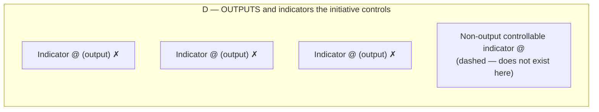
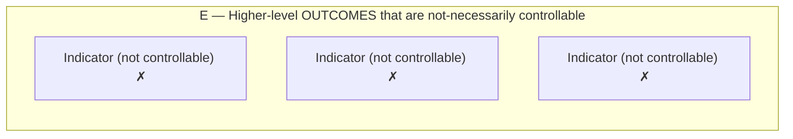

# DoView Tool D13 — Search for the Non-Output Controllable Indicator Explainer

> **Pair:** [Question](d13question.md) · Tool (this page)

In an outcomes-oriented environment, central agencies or providers/funders often pressurize suppliers/providers to identify indicators that are 'outcomes not outputs' because outputs are usually lower down the relevant DoView strategy/outcomes diagram. Meanwhile, they can insist that selected indicators must be controllable and hence automatically attributable so that they can be used for accountability purposes.

But indicators higher up a DoView diagram or outcomes framework are often not-necessarily controllable. Just measuring them will not automatically prove attribution to the initiative in question. Hence, the search for the 'non-output controllable indicator', which sometimes, unfortunately, just cannot be identified.

Below, two components from the DoView Planning Framework (D1) are used to illustrate this. Looking outcomes system component D in the framework, all of the possible indicators have been ruled out because they are outputs, in favor of a mythical 'non-output controllable indicator,' but unfortunately, no such thing exists.

## Diagram

### D — OUTPUTS and indicators the initiative controls

Indicators in D are ruled-out because they are outputs and the dashed box (the hoped-for 'non-output controllable indicator') simply does not exist in this particular strategy/outcomes diagram.

### E — Higher-level OUTCOMES that are not-necessarily controllable

Indicators in E are ruled-out for not being controllable and therefore not attributable.

The pressure to find a 'non-output controllable indicator' simultaneously rules out the indicators in D (because they are outputs) and the indicators in E (because they are not controllable) — leaving a gap that often cannot be filled.

---

*Source: DOVIEW PLANNING AND PRACTICAL OUTCOMES THEORY HANDBOOK (2025). DoView Planning.Org. Copyright Dr Paul W Duignan.*
