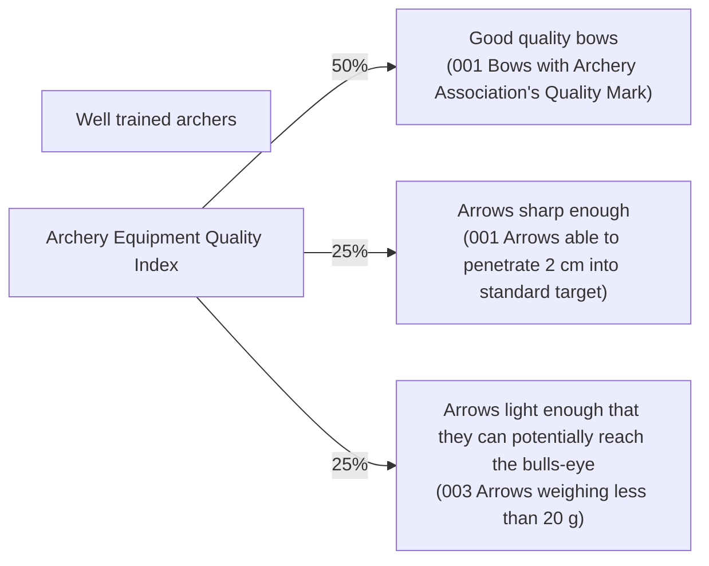

# DoView Tool D14 — When an Index Should be Used Checklist

> **Pair:** [Question](d14question.md) · Tool (this page)

An index numerically combines a number of indicators into a single number. Whether the individual indicators contributing to an index appropriately capture what it is trying to measure needs to be clear. Also, each indicator's relative contribution to the index (their 'weights') has to make sense. Indexes may be 'gamed' by changing the weight of individual indicators. To be fully transparent, show an index's individual contributing indicators against the relevant DoView diagram as in B below. Also, consider using a spider graph to show individual indicator results.

## Diagram

### A — Checklist

1. Are there multiple boxes within the relevant DoView strategy/outcomes diagram that you want to report on with a summary number? IF YES, AN INDEX MAY BE APPROPRIATE.

2. Does it make logical sense to combine the different boxes within the DoView diagram? IF YES, AN INDEX MAY BE APPROPRIATE.

3. Is there some clear rationale that stakeholders will accept regarding the way in which contributing indicators should be combined numerically into the overall index score? IF YES, AN INDEX MAY BE APPROPRIATE.

4. Is the index being presented against the underlying DoView diagram so that information on 1 - 3 is immediately available to anyone looking at the index number? IF NOT, WHY NOT?

### B — Index shown against the underlying DoView diagram

The Archery Equipment Quality Index combines three weighted indicators (50% / 25% / 25%) drawn from boxes in the underlying DoView strategy/outcomes diagram. "Well trained archers" is shown but is not part of the index.

---

*Source: DOVIEW PLANNING AND PRACTICAL OUTCOMES THEORY HANDBOOK (2025). DoView Planning.Org. Copyright Dr Paul W Duignan.*
