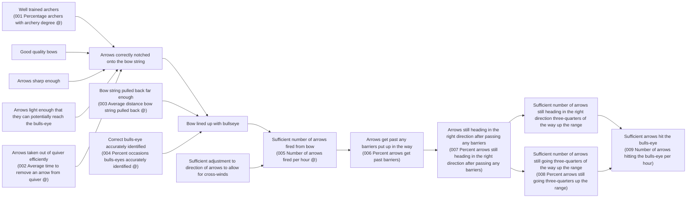

# DoView Tool D5 — Putting Indicators Onto a DoView Strategy/Outcomes Diagram

> **Pair:** [Question](d5question.md) · Tool (this page)

Indicators can be put onto a DoView strategy/outcomes diagram to show which boxes they measure and their level within the diagram. You can mark controllable indicators with a '@' to differentiate them from higher-level not-necessarily controllable indicators (usually described as outcomes) for clearer accountability, delegation, and contracting discussions.

## Diagram

The DoView uses an archery metaphor. Boxes describe steps and outcomes in the archery process; indicators (numbered 001–009) are attached to specific boxes. `@` marks controllable indicators; unmarked indicators are not-necessarily controllable (outcomes).

`@` = Controllable indicators. Indicators without `@` are not-necessarily controllable (typically outcome-level).

---

*Source: DOVIEW PLANNING AND PRACTICAL OUTCOMES THEORY HANDBOOK (2025). DoView Planning.Org. Copyright Dr Paul W Duignan.*
