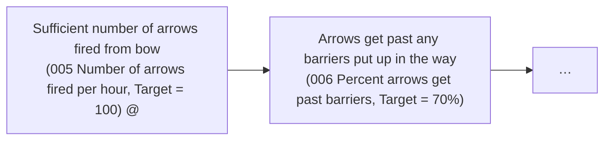

# DoView Tool D7 — Good Targets Checklist

> **Pair:** [Question](d7question.md) · Tool (this page)

Two targets are shown below for indicators put onto part of a DoView strategy/outcomes diagram. The target on the controllable indicator "@" on the left could be used as a deliverable. But the not-necessarily controllable target on the right would be better as a 'collective' or 'sector' target. A separate initiative — a team working to remove barriers to arrows getting to the target — could also influence the outcome.

## Diagram

The left box's indicator is controllable (`@`) and so its target can be used as a direct deliverable. The right box's indicator is not-necessarily controllable, so its target is better set as a 'collective' or 'sector' target.

### Checklist

1. Do the targets cover the full range of priority boxes within the relevant DoView strategy/outcomes diagram? IF YES, THEY ARE APPROPRIATE.

2. Are the targets located at a similar level (high or low) within the relevant DoView strategy/outcomes diagram? For instance, do some of the targets relate to boxes much lower down the diagram than others? IF THEY ARE AT A SIMILAR POSITION, THEY ARE APPROPRIATE.

3. Are the targets realistic within the resources available for achieving them? IF YES, THEY ARE APPROPRIATE.

4. If relevant, has a timeframe been set to achieve the targets? IF NOT, SET IT.

5. Is any timeframe that has been set realistic within the resources currently available? IF NOT, EITHER LENGTHEN THE TIMEFRAME OR INCREASE THE ALLOCATED RESOURCES.

6. Are the targets controllable by the organization, agency, provider, policy or initiative? IF NOT, SET THE TARGETS AS 'COLLECTIVE' OR 'SECTOR' TARGETS\*.

5. Are the targets being presented against the underlying DoView strategy/outcomes diagram so that information on 1, 2, and 6 can be quickly communicated to anyone looking at the target set? IF NOT, WHY NOT?

\* See the Types of Contracting For Outcomes or Outputs (E3) on this.

---

*Source: DOVIEW PLANNING AND PRACTICAL OUTCOMES THEORY HANDBOOK (2025). DoView Planning.Org. Copyright Dr Paul W Duignan.*
