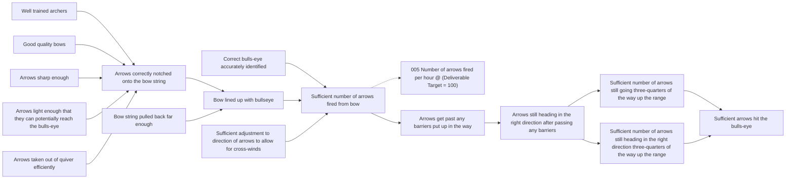

# DoView Tool E6 — DoView Outcomes-Based Contracting using a DoView Strategy/Outcomes Diagram in Supplier/Provider Contracts

> **Pair:** [Question](e06question.md) · Tool (this page)

There needs to be alignment between the deliverables specified in a supplier/provider contract and the higher-level outcomes sought by a purchaser/funder which the provider is contracting with. In DoView Planning, this alignment is achieved by attaching a DoView strategy/outcomes diagram to the supplier/provider contract. This is marked up with the specific deliverables the supplier/provider is responsible for. If the DoView diagram the purchaser/funder is using is too high-level, then more detailed drill-down subpages can be developed under it. It is a good idea for any supplier/provider to be aware of this wider outcomes context. In addition, the marked-up DoView diagram can play a central role when using Type 3 contracting (for outputs and controllable indicators plus 'managing for outcomes') from the Types of Contracting and Delegating for Outcomes or Outputs (E3). Note that if providers have a number of different contracts, which all use DoView Outcomes-Based Contracting, they can use the How An Initiative Can Deal With Multiple 'Outcomes Sets' Tool (B18) to manage these efficiently. Below is shown a DoView diagram from the 'Archery Initiative' Strategy/Outcomes Diagram Example (B4) with a deliverable with a target marked up on it.

## Diagram

`@` = Controllable indicators. The orange-tagged box (`005 Number of arrows fired per hour`) is the deliverable with its target (100) attached to the relevant step in the strategy/outcomes diagram.

---

*Source: DOVIEW PLANNING AND PRACTICAL OUTCOMES THEORY HANDBOOK (2025). DoView Planning.Org. Copyright Dr Paul W Duignan.*
