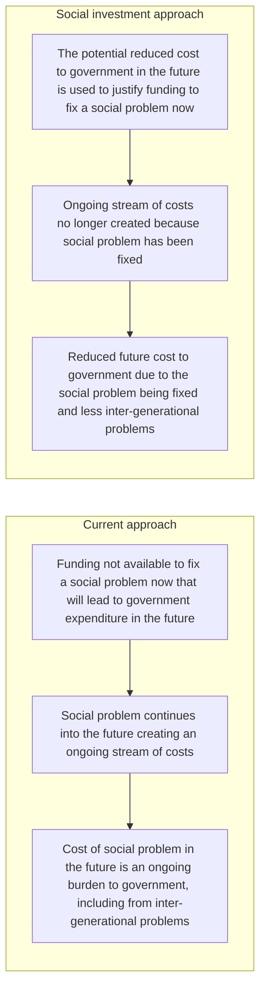

# DoView Tool E11 — Suitability of a Social Investment Approach Checklist

> **Pair:** [Question](e11question.md) · Tool (this page)

## Diagram

## Suitability of a Social Investment Approach Checklist

1. Is the social issue one that will create ongoing future financial costs to the government (e.g. treatment, imprisonment, affected third parties such as children)? IF YES, A SOCIAL INVESTMENT APPROACH MAY BE APPROPRIATE.

2. Are there evidence-based interventions that can be used now that are likely to reduce the social problem in the future? IF YES, A SOCIAL INVESTMENT APPROACH MAY BE APPROPRIATE.

3. Do the actuarial projections of costs and benefits work out to show a net benefit? IF YES, A SOCIAL INVESTMENT APPROACH MAY BE APPROPRIATE. EVEN IF THIS ANALYSIS DOES NOT SHOW A CLEAR NET BENEFIT, ANY COST SAVINGS IT DOES SHOW MAY BE ABLE TO BE USED TO BOLSTER THE ARGUMENT FOR INTERVENING BASED ON THE THIRD RATIONALE FOR GOVERNMENT ASSISTING CITIZENS (CREATING A LEVEL PLAYING FIELD)\*.

\* See the Determining Whose Outcomes - Citizen or Government's - The Rationales for Government Assistance Framework (B20).

---

*Source: DOVIEW PLANNING AND PRACTICAL OUTCOMES THEORY HANDBOOK (2025). DoView Planning.Org. Copyright Dr Paul W Duignan.*
