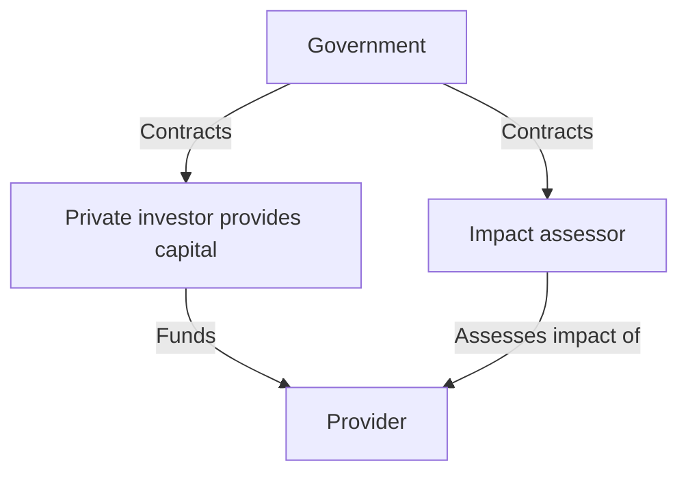

# How can we get funding for fixing social problems which does not come from government expenditure (social bonds)?

> **Pair:** Question (this page) · [Tool](e12tool.md)

Social bonds are a public sector financing approach that seeks funding from outside government to enable work to be done on social problems or service delivery. The idea is that an investor provides funding to improve a social problem or issue, or to provide a service. If they are successful, they get rewarded. If they are not successful, they lose the money they have invested. This approach is sometimes used in a social investment approach.

It is an attempt to mimic what happens in the private sector and is sometimes referred to as providers having 'skin in the game' regarding achieving outcomes.

In a social bonds set up, there is an 'investor', a 'provider' and an 'impact assessor.' The job of the impact assessor is to verify that the social issue has been improved by the provider.

There are a number of risks that need to be considered when setting up social bond schemes and these are covered in this Social Bonds Suitability Checklist (E11).

## Diagram

---

*Source: DOVIEW PLANNING AND PRACTICAL OUTCOMES THEORY HANDBOOK (2025). DoView Planning.Org. Copyright Dr Paul W Duignan.*
