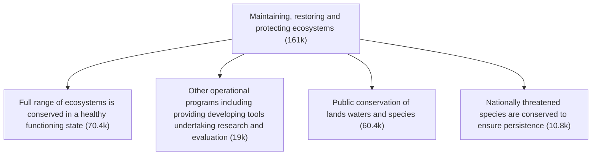

# DoView Tool E8 — Showing Funding Allocated to Agencies/Suppliers/Providers on a DoView Strategy/Outcomes Diagram

> **Pair:** [Question](e8question.md) · Tool (this page)

The amount of funding allocated to each activity area has been mapped onto the overall outcome in the DoView strategy/outcomes diagram below. This provides a clearer picture of how funding is being used than the traditional table format, usually used to detail the allocation of funding by purchasers/funders to agencies/suppliers/providers. It should be noted that to avoid siloization as discussed in the Not Siloing Steps Under Outcomes Explainer (B16), a project that has been allocated a budget should be able to apportion its budget across more than one outcome box if this reflects the fact that it is directed at influencing more than one outcome.

## Diagram

The dollar amount allocated to each outcome box is shown in the small chip attached to the box. The top-level outcome (`161k`) is the sum of funding rolled up across the activity boxes beneath it.

---

*Source: DOVIEW PLANNING AND PRACTICAL OUTCOMES THEORY HANDBOOK (2025). DoView Planning.Org. Copyright Dr Paul W Duignan.*
