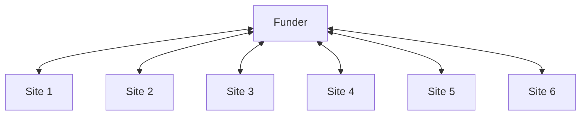
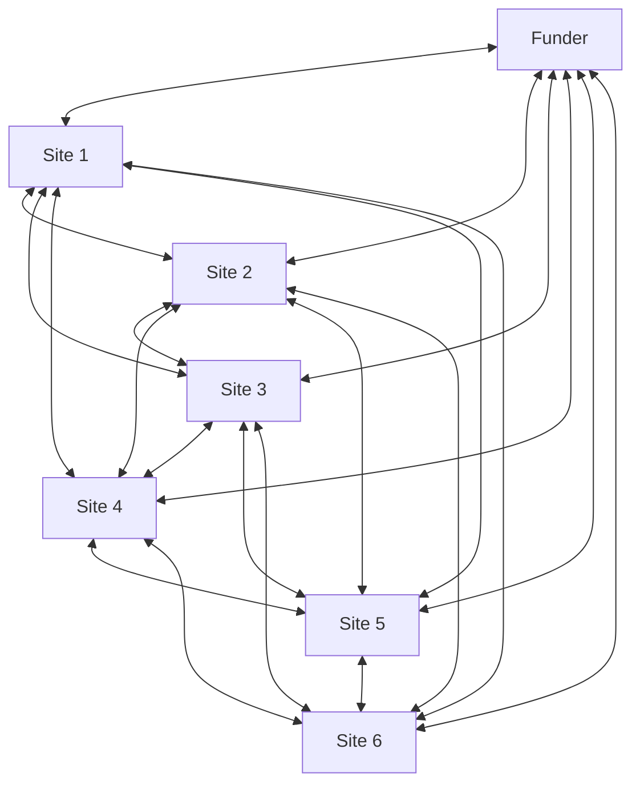

# DoView Tool F3 — Group Action Planning for Implementing Multiple Similar Services or Initiatives

> **Pair:** [Question](f03question.md) · Tool (this page)

Often, a similar service or initiative is being implemented in a number of different branches of a large organization, geographic sites or within different settings. One approach in such a situation is for the purchaser/funder to have many one-to-one interactions with the different sites. However, this tool provides an alternative approach. This is getting the sites or initiatives to collaborate in an ongoing Group Action Planning workshop series (face-to-face and/or virtual) where they all work together over a number of years using a peer-based approach to jointly sharing best practice, improving and evaluating their progress with implementation. Ideally the workshops will be facilitated by an independent person, for instance an implementation evaluator.

## Diagram

### Option 1 — Separate interactions between purchaser/funder and separate initiatives

### Option 2 — Group Action Planning

In Option 1 the funder hubs each site separately. In Option 2 the sites also interact with each other in an ongoing peer-based Group Action Planning workshop series, in addition to their interactions with the funder.

---

*Source: DOVIEW PLANNING AND PRACTICAL OUTCOMES THEORY HANDBOOK (2025). DoView Planning.Org. Copyright Dr Paul W Duignan.*
