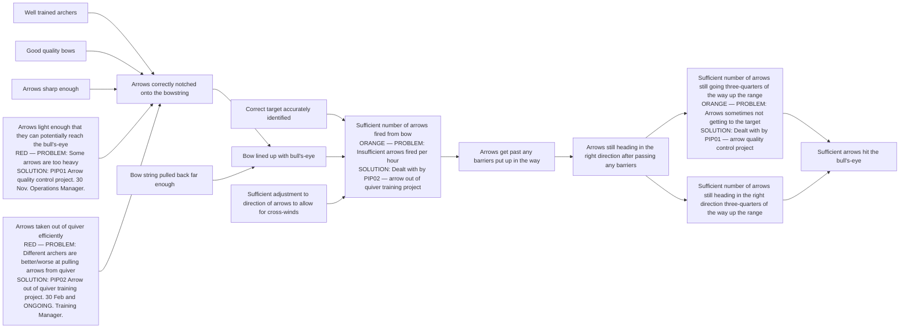

# DoView Tool F1 — Using a DoView Strategy/Outcomes Diagram for Performance Improvement

> **Pair:** [Question](f1question.md) · Tool (this page)

This DoView strategy/diagram from the 'Archery Initiative' Strategy/Outcomes Diagram Example (B4) shows how such a diagram can be used for performance improvement diagnosis and identifying Performance Improvement Projects (PIPs) to fix the problems.

## Diagram

Each box is examined diagnostically and marked with a traffic light. Red and orange boxes get a Performance Improvement Project (PIP) attached, naming the problem, the project that addresses it, the deadline, and the responsible role.

---

*Source: DOVIEW PLANNING AND PRACTICAL OUTCOMES THEORY HANDBOOK (2025). DoView Planning.Org. Copyright Dr Paul W Duignan.*
