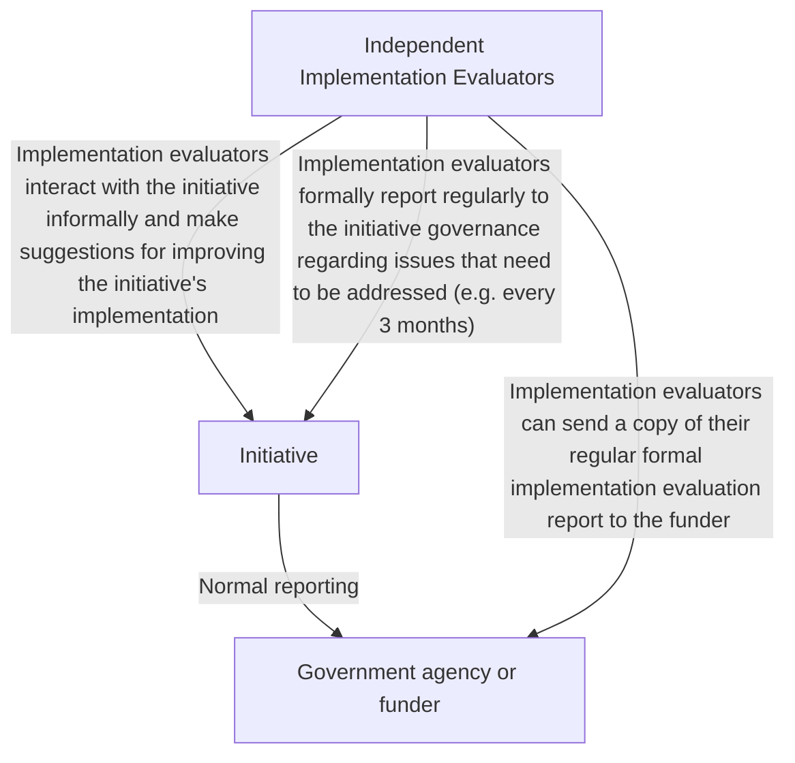

# DoView Tool F2 — Independent Parallel Implementation Evaluation

> **Pair:** [Question](f2question.md) · Tool (this page)

A purchaser/funder interested in optimizing an initiative's implementation can employ an independent organization to perform an ongoing independent implementation evaluation (formative evaluation) of the initiative.

## Diagram

---

*Source: DOVIEW PLANNING AND PRACTICAL OUTCOMES THEORY HANDBOOK (2025). DoView Planning.Org. Copyright Dr Paul W Duignan.*
