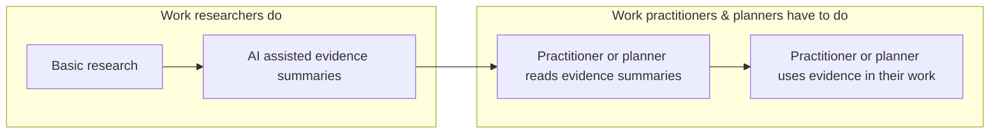
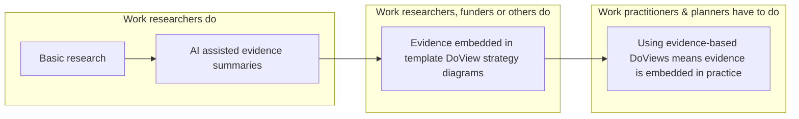

# DoView Tool F6 — Embedding Evidence in DoView Strategy/Outcomes Diagram Templates Tool

> **Pair:** [Question](f6question.md) · Tool (this page)

You can construct DoView strategy/outcomes diagrams as template strategy/outcomes diagrams and embed evidence within them. If practitioners and planners then use these in their planning and implementation work, evidence-based practice can be fostered without requiring additional work on the part of practitioners and planners. It does not even matter whether practitioners and planners are even particularly aware that they are using evidence-based practice when their work is being guided in this way.

## Diagram

### Current approach

### Evidence-embedded DoView strategy/outcomes diagram template approach

In the current approach, practitioners and planners have to actively read evidence summaries before using them. In the evidence-embedded approach, the work of integrating evidence is done upstream — practitioners get evidence-based practice automatically by using the templates.

---

*Source: DOVIEW PLANNING AND PRACTICAL OUTCOMES THEORY HANDBOOK (2025). DoView Planning.Org. Copyright Dr Paul W Duignan.*
