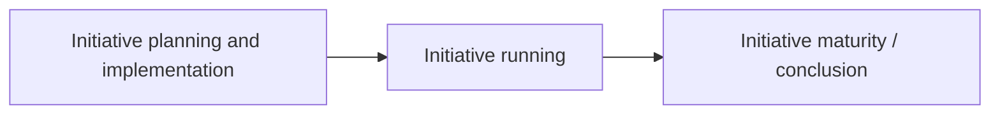

# DoView Tool G4 — Different Types of Evaluation Over an Initiative's Life-Cycle

> **Pair:** [Question](g04question.md) · Tool (this page)

The different types of evaluation and when best to use them within an initiative's life-cycle are shown below. Overall evaluation approaches such as Indigenous Evaluation, Utilization-focused and Empowerment Evaluation are particularly important at the start of evaluation planning but are also used right across an initiative's life-cycle.

## Diagram

### Evaluation types across the life-cycle

| Life-cycle stage | Evaluation types |
|---|---|
| Initiative planning and implementation | Developmental Evaluation; Formative Evaluation (both part of Implementation Evaluation) |
| Initiative running | Process Evaluation |
| Initiative maturity / conclusion | Impact Evaluation; Economic Evaluation; Summative Evaluation |

### Evaluation type descriptions

| Evaluation type | Description |
|---|---|
| Developmental Evaluation | Very early-stage evaluation looking at conceptualizing the problem and the initiative, needs analysis, problem definition, and very early discussions with stakeholders. It can be viewed as a very early stage of implementation evaluation, but when planning is still very fluid. |
| Formative Evaluation | Evaluation to optimize initiative implementation and make sure that it is 'well-formed'. Part of Implementation Evaluation. |
| Process Evaluation | Evaluation describing the course and context of an initiative. First, used to interpret the results from Impact Evaluation. Second, helps provide information for anyone who wants to replicate a successful initiative. Third, understanding the context can reveal things such as the fact that easy non-challenging initiatives are being promoted rather than challenging but more effective ones. |
| Impact Evaluation | Evaluation measuring the effect of an initiative on its high-level outcomes. Also called Outcome Evaluation. |
| Economic Evaluation | Looks at the value for money of an initiative. |
| Summative Evaluation | Evaluation attempting to provide an overall assessment of the value of an initiative. |

---

*Source: DOVIEW PLANNING AND PRACTICAL OUTCOMES THEORY HANDBOOK (2025). DoView Planning.Org. Copyright Dr Paul W Duignan.*
