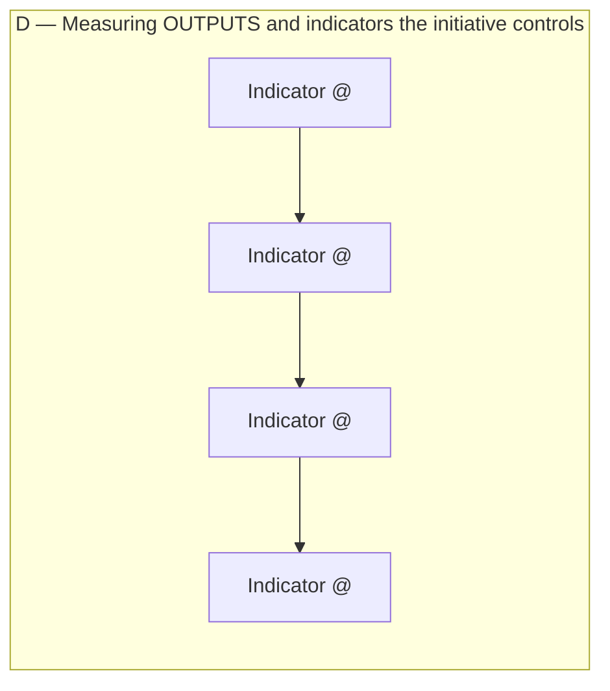
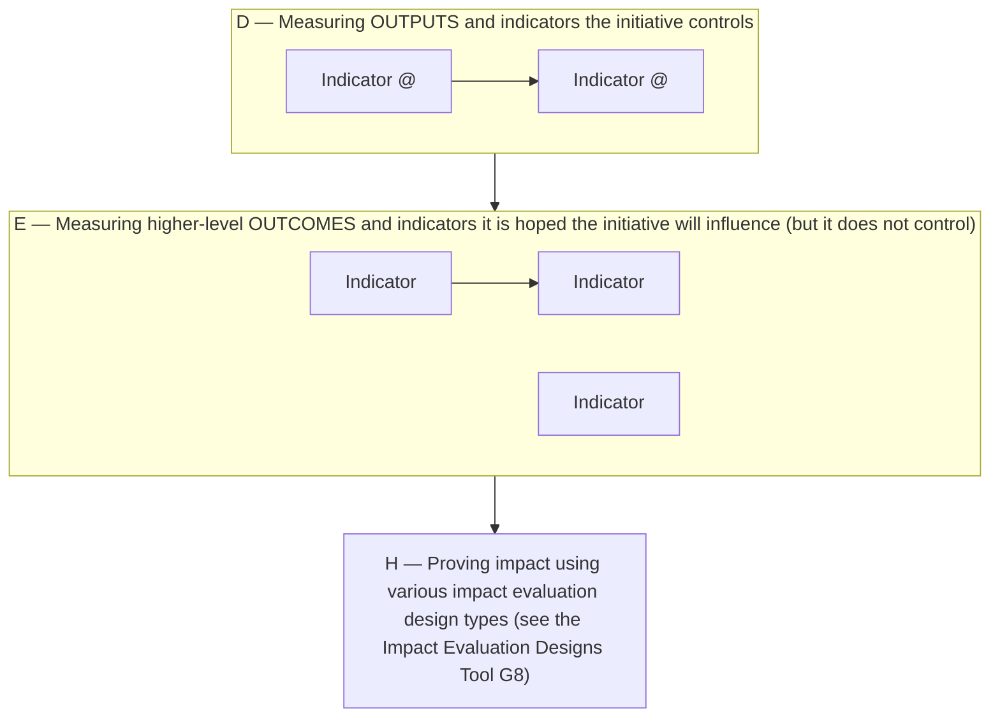

# DoView Tool G5 — When Impact Evaluation Is Needed Rather Than Just Measuring High-Level Outcome Indicators

> **Pair:** [Question](g05question.md) · Tool (this page)

'A' below shows a case where controllable-indicators (Component D from the DoView Planning Framework (D1)) reach to the top of the relevant DoView strategy/outcomes diagram. In such a case, you do not need impact evaluation. However, 'B' shows where this is not the case, and only not-necessarily controllable indicators are at the top of the DoView diagram (Component E). In such a case, impact evaluation (Component H) is needed to establish attribution of improvements in high-level indicators to the initiative.

## Diagram

### A — Controllable indicators reach the top (no impact evaluation needed)

### B — Controllable indicators do not reach the top (impact evaluation needed)

Sometimes controllable indicators in Component D do not reach to the 'top' of the strategy/outcomes diagram as in this case (they are marked with '@s'); then impact evaluation (Component H) will be needed to prove attribution of high-level outcomes to the initiative.

---

*Source: DOVIEW PLANNING AND PRACTICAL OUTCOMES THEORY HANDBOOK (2025). DoView Planning.Org. Copyright Dr Paul W Duignan.*
