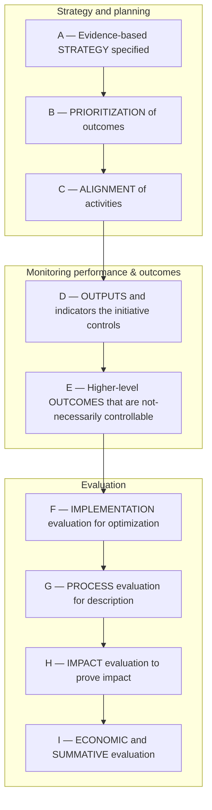

# DoView Tool G6 — Generic Evaluation Questions List

> **Pair:** [Question](g06question.md) · Tool (this page)

Use these generic questions shown on the DoView Planning Framework (D1) to quickly plan an evaluation or to assess an existing set of evaluation questions for any initiative in any sector on any topic.

## Diagram

### Generic evaluation questions by component

| # | Component | Question |
|---|---|---|
| 1 | A — Evidence-based STRATEGY | Does the initiative have a logical strategy, is it evidence-based, are its activities focused on its priorities? (strategy diagram, logic modeling, theory of change, results chain, outcomes modeling, strategy modeling). |
| 2 | A — Evidence-based STRATEGY | Does the initiative effectively embody a required cultural or value orientation (e.g. a particular cultural perspective)? (indigenous evaluation, empowerment evaluation). |
| 3 | D — OUTPUTS and indicators | What measurable things has the initiative actually done which can be proved have been done by it just because they are controllable by it? (outputs measurement, controllable indicator measurement). |
| 4 | E — Higher-level OUTCOMES | What trends are there in high-level outcomes (regardless of whether these can at the moment be proved to have been caused by the initiative)? (high-level outcomes monitoring, state indicator tracking). |
| 5 | F — IMPLEMENTATION evaluation | What changes need to be made to make the initiative implementation better? (implementation, developmental, formative evaluation). |
| 6 | F — IMPLEMENTATION evaluation | How does this initiative compare to the performance and success of similar initiatives? (benchmarking). |
| 7 | G — PROCESS evaluation | What actually happened in the course and context of the initiative and how did this compare to its original rationale? (process evaluation). |
| 8 | H — IMPACT evaluation | What improvements in high-level outcomes can be proved to have been caused by the initiative? (impact or outcome evaluation). |
| 9 | I — ECONOMIC and SUMMATIVE | What is the economic cost of the initiative, what is it producing for this cost and do its dollar benefits outweigh its dollar cost? (economic evaluation). |
| 10 | I — ECONOMIC and SUMMATIVE | Overall what is the assessed merit and worth of the initiative? (summative evaluation). |
| 11 | Cross-cutting | What philosophy, cultural and values perspective will the evaluation use and how will the evaluation be managed? (evaluation approach and management, indigenous evaluation, empowerment evaluation). |

---

*Source: DOVIEW PLANNING AND PRACTICAL OUTCOMES THEORY HANDBOOK (2025). DoView Planning.Org. Copyright Dr Paul W Duignan.*
