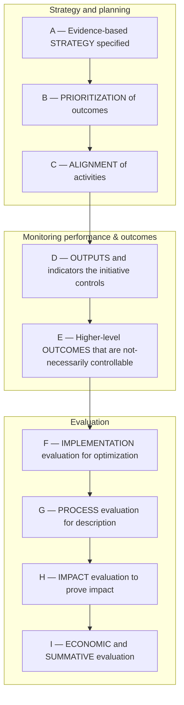

# DoView Tool G1 — Types of Evaluation Mapped Onto the DoView Planning Framework

> **Pair:** [Question](g1question.md) · Tool (this page)

Below is the DoView Planning Framework (D1) showing the different types of evaluation related to each of the components. Overall evaluation approaches such as Indigenous Evaluation, Utilization-focused Evaluation, and Empowerment Evaluation can be used throughout each of these components. This tool can be included in evaluation documentation (e.g. Requests for Proposals RFPs) to make sure that everyone is talking the same language regarding evaluation types.

## Diagram

### Evaluation types by component

| Component | Evaluation types |
|---|---|
| A — Evidence-based STRATEGY specified | Empowerment Evaluation - ensuring all voices are heard in strategy development; Developmental Evaluation - helping with very early thinking; Formative and Implementation Evaluation - assessing whether the initiative's strategy has a clear logic and whether it is evidence-based. Can include specific tools such stakeholder consultation; peer review of the initiative's strategy diagram; and, literature review. |
| B — PRIORITIZATION of outcomes | Implementation Evaluation - looking at whether clear priorities have been set and defended. Can include specific tools such as stakeholder consultation and peer review regarding what should be priorities within the initiative's strategy diagram. |
| C — ALIGNMENT of activities | Implementation Evaluation - looking at whether there is alignment between priority outcomes and projects or activities. Can use specific tools such as "Line-of-Sight Alignment" within a strategy diagram. |
| D — OUTPUTS and indicators the initiative controls | Monitoring outputs provides information for Process Evaluation about the scope, reach, and resource utilization of the initiative. Can provide information for Economic Evaluation about the cost of the initiative. Can be used in specific types of Impact Evaluation. If controllable indicators reach to the top of the strategy diagram, this can provide proof of attributable impact for Impact Evaluation. |
| E — Higher-level OUTCOMES that are not-necessarily controllable | Measuring high-level outcomes informs Developmental, Formative and Implementation Evaluation for future initiatives because it provides information on how high-level trends are tracking and this can be used to decide on where future interventions should be focused. |
| F — IMPLEMENTATION evaluation for optimization | Implementation Evaluation consists of Empowerment Evaluation to make sure all voices are heard; Developmental Evaluation (early-stage needs analysis, problem definition, and stakeholder consultation) and Formative Evaluation, later stage Implementation Evaluation. |
| G — PROCESS evaluation for description | Process Evaluation to describe the course and context of the initiative. This is used to interpret impact evaluation findings. Also to replicate successful initiatives. And information on the context of the initiative can be useful for identifying whether an initiative is the most appropriate approach at the particular point in time. |
| H — IMPACT evaluation to prove impact | Impact Evaluation measures and attributes changes in outcomes to an initiative. If available in time, it can feed into initiative improvement through Implementation Evaluation. Useful for Economic Evaluation (provides effect-sizes) and Summative Evaluation. |
| I — ECONOMIC and SUMMATIVE evaluation | Economic Evaluation looks at the value for money of an initiative and attempts to sum up all costs and benefits by putting them into the common unit of dollars. Summative Evaluation is an overall assessment of the merit and worth of an initiative. |

---

*Source: DOVIEW PLANNING AND PRACTICAL OUTCOMES THEORY HANDBOOK (2025). DoView Planning.Org. Copyright Dr Paul W Duignan.*
